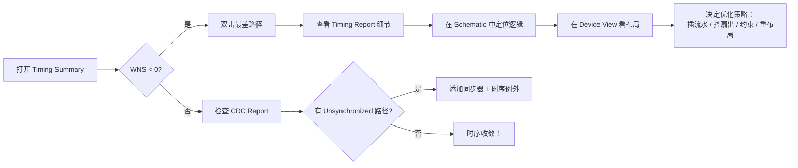

## 🎨 Vivado GUI：五大关键视图

### 1. **Timing Summary（时序概览）**
- **路径**：`Flow Navigator → [Synthesis / Implementation] → Report Timing Summary`
- **核心指标**：
  - **WNS**（Worst Negative Slack）：最差建立裕量（<0 表示违例）
  - **TNS**（Total Negative Slack）：所有违例 slack 总和（反映整体严重性）
  - **WHS**（Worst Hold Slack）：保持时间裕量
  - **Clocks 表**：频率、抖动、不确定性
- ✅ **技巧**：双击 WNS 值 → 自动打开最差路径详情

---

### 2. **Detailed Timing Report（路径详情）**
- **路径**：
  - `Open Implemented Design → Reports → Timing → Report Timing`
  - 或在 Timing Summary 中右键某行 → **Report Timing**
- **关键信息**：
  - 路径类型（Setup / Hold）
  - Launch / Capture 时钟
  - Data Path Delay vs Clock Skew
  - **Logic Level**（组合逻辑层级数）
  - **High Fanout Nets**（标红警告）
- ✅ **技巧**：点击 Instance/Pin → 自动高亮 **Schematic** 或 **Device View**

---

### 3. **Schematic Viewer（原理图视图）**
- **路径**：在 Timing Report 中选中路径 → 右键 → **Schematic**
- **用途**：
  - 可视化关键路径逻辑结构
  - 快速识别长组合链（如 8 级 LUT）、未流水模块
  - 支持搜索、缩放、信号高亮
- 💡 **实战建议**：发现长逻辑链？→ 立即在中间插入流水寄存器

---

### 4. **Device View（器件布局视图）**
- **路径**：Timing Report → 右键路径 → **Show in Device**
- **关注点**：
  - 路径是否跨越多个 CLB 区域？
  - 寄存器与驱动逻辑是否物理分离？
  - 布线是否绕远（导致延迟激增）？
- ✅ **优化提示**：若路径横跨芯片 → 考虑 pblock 约束或 RTL 重构

---

### 5. **CDC Viewer（跨时钟域分析）**
- **路径**：`Open Implemented Design → Reports → Timing → Report CDC`
- **关键项**：
  - **Unsynchronized Paths**（红色！必须处理）
  - **Synchronizer Stages**（应 ≥2）
  - **Clock Domain Pairs**（异步对列表）
- ⚠️ **警告**：任何未同步的 CDC 路径都可能导致**亚稳态+间歇性故障**

---

## 🎨 Quartus Prime GUI：TimeQuest 五大核心视图

### 1. **Timing Summary（TimeQuest）**
- **路径**：`Timing Analyzer → Reports → Timing Summary`
- Report clocks
- Report Fmax Summary
- Report Top Failing Paths
- **看什么**：
  - Setup / Hold Slack 列表
  - **Clock Transfer Table**（同步/异步关系）
  - Failing Paths 总数
- ✅ **技巧**：点击 slack 值 → 自动打开详细路径

---

### 2. **Report Timing（详细路径）**
- **操作**：双击 Summary 行或手动指定 From/To
- **关键字段**：
  - Arrival Time vs Required Time
  - **Logic Depth**（等效 LUT 级数）
  - 各节点 **Fan-out**
- 💡 **提示**：右键信号 → **Locate → Technology Map Viewer** 查看底层实现

---

### 3. **Technology Map Viewer（技术映射视图）**
- **路径**：`Tools → Netlist Viewers → Technology Map Viewer (Post-Mapping)`
- **作用**：
  - 查看 RTL → LUT/FF/MUX 的映射结果
  - 验证是否成功推断 RAM/DSP
  - 确认流水寄存器是否真实存在
- ✅ **对比技巧**：优化前后对比，直观感受效果

---

### 4. **Chip Planner（芯片规划器）**
- **路径**：`Tools → Chip Planner`
- **用途**：
  - 查看关键寄存器物理位置
  - 判断是否集中（利于高速）
  - 检查 IO 寄存器是否靠近引脚
- 💡 **高级用法**：手动锁定关键模块位置，提升 P&R 稳定性

---

### 5. **CDC Analyzer（仅 Prime Pro）**
- **路径**：`Tools → CDC Analyzer`
- **功能**：
  - 自动扫描跨时钟域路径
  - 标记未同步信号
  - 提供修复建议（如同步器插入）
- ⚠️ **注意**：Standard 版本无此功能，需手动检查或借助 lint 工具

---

## 🔁 GUI 时序诊断黄金流程（推荐）

---

## ✅ 总结：必须掌握的 5 大 GUI 视图清单

| 工具        | 视图名称                  | 核心价值                         |
|-------------|--------------------------|----------------------------------|
| **Vivado**  | Timing Summary           | 全局收敛状态快速判断             |
|             | Detailed Timing Report    | 路径构成与瓶颈分析               |
|             | Schematic Viewer         | 逻辑结构可视化（RTL → Gate）     |
|             | Device View              | 物理布局影响评估                 |
|             | CDC Report               | 亚稳态风险排查                   |
| **Quartus** | Timing Summary (TimeQuest)| 全局时序概览                     |
|             | Technology Map Viewer    | 底层资源映射验证                 |
|             | Chip Planner             | 布局布线影响分析                 |
|             | CDC Analyzer（Pro 版）   | 自动化跨时钟域检查               |

---

## 💡 终极建议

> **“不要只看 Slack 数字，要看路径的‘长相’。”**  
> - 逻辑是否太长？→ 插流水  
> - 扇出是否太高？→ 加 buffer 或复制  
> - 布局是否太散？→ 约束区域  
> - 时钟是否异步？→ 同步 + false_path  
>
> **GUI 的真正价值，在于将抽象时序转化为可操作的工程洞察。**

---

# 标签  
#FPGA #时序分析 #Vivado #Quartus #GUI #TimingReport #CDC #Schematic #DeviceView #ChipPlanner #时序收敛 #可视化调试