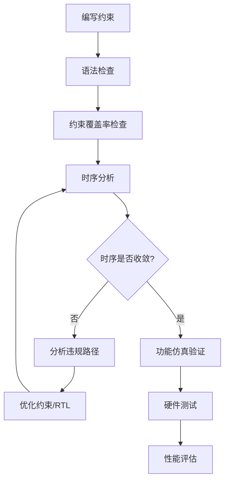
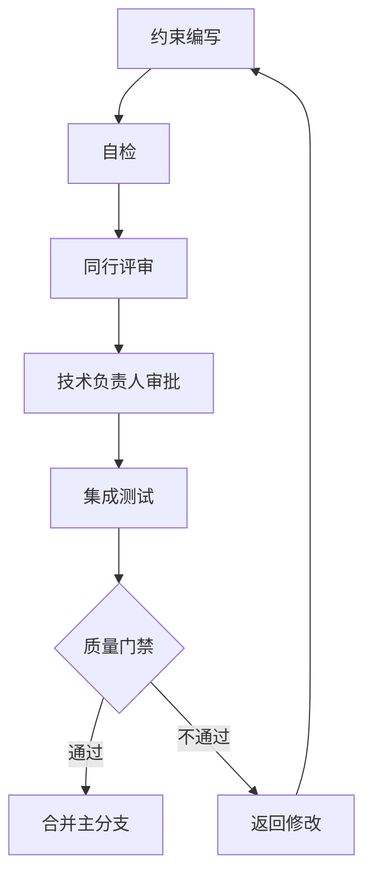
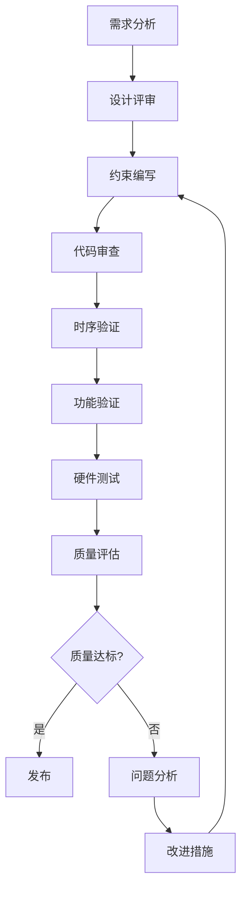

# 时序约束最佳实践

## 目录

1. [1. 约束编写原则](%E6%97%B6%E5%BA%8F%E7%BA%A6%E6%9D%9F%E6%9C%80%E4%BD%B3%E5%AE%9E%E8%B7%B5.md#1.%20约束编写原则)
2. [2. 调试技巧](%E6%97%B6%E5%BA%8F%E7%BA%A6%E6%9D%9F%E6%9C%80%E4%BD%B3%E5%AE%9E%E8%B7%B5.md#2.%20调试技巧)
3. [3. 性能优化建议](%E6%97%B6%E5%BA%8F%E7%BA%A6%E6%9D%9F%E6%9C%80%E4%BD%B3%E5%AE%9E%E8%B7%B5.md#3.%20性能优化建议)
4. [4. 文档管理](%E6%97%B6%E5%BA%8F%E7%BA%A6%E6%9D%9F%E6%9C%80%E4%BD%B3%E5%AE%9E%E8%B7%B5.md#4.%20文档管理)
5. [5. 团队协作](%E6%97%B6%E5%BA%8F%E7%BA%A6%E6%9D%9F%E6%9C%80%E4%BD%B3%E5%AE%9E%E8%B7%B5.md#5.%20团队协作)
6. [6. 工具配置优化](%E6%97%B6%E5%BA%8F%E7%BA%A6%E6%9D%9F%E6%9C%80%E4%BD%B3%E5%AE%9E%E8%B7%B5.md#6.%20工具配置优化)
7. [7. 常见陷阱与避免方法](%E6%97%B6%E5%BA%8F%E7%BA%A6%E6%9D%9F%E6%9C%80%E4%BD%B3%E5%AE%9E%E8%B7%B5.md#7.%20常见陷阱与避免方法)
8. [8. 项目管理最佳实践](%E6%97%B6%E5%BA%8F%E7%BA%A6%E6%9D%9F%E6%9C%80%E4%BD%B3%E5%AE%9E%E8%B7%B5.md#8.%20项目管理最佳实践)

---

## 1. 约束编写原则

### 1.1 分层约束策略

#### 约束文件组织
```tcl
# 顶层约束文件：timing_constraints.xdc
source clock_constraints.xdc      # 时钟相关约束
source io_constraints.xdc         # 输入输出约束  
source exception_constraints.xdc  # 例外约束
source physical_constraints.xdc   # 物理约束
```

#### 约束优先级
1. **时钟约束**：最高优先级，必须首先正确定义
2. **输入/输出约束**：确保接口时序正确
3. **例外约束**：处理特殊路径
4. **物理约束**：优化布局布线

### 1.2 约束编写规范

#### 1. 命名规范
```tcl
# 使用有意义的时钟名称
create_clock -period 10.0 -name sys_clk_100mhz [get_ports clk_in]
create_clock -period 8.0 -name ddr_clk_125mhz [get_ports ddr_clk]

# 使用描述性的约束组名
set_clock_groups -name async_clk_groups -asynchronous \
    -group [get_clocks sys_clk_100mhz] \
    -group [get_clocks ddr_clk_125mhz]
```

#### 2. 注释规范
```tcl
#==============================================================================
# 时钟约束
# 作者：张三
# 日期：2024-01-15
# 描述：系统主时钟和DDR时钟约束
#==============================================================================

# 系统主时钟：100MHz，来自外部晶振
create_clock -period 10.0 -name sys_clk_100mhz [get_ports clk_in]
set_clock_uncertainty 0.2 [get_clocks sys_clk_100mhz]  # 考虑PLL抖动

# DDR控制器时钟：125MHz，由PLL生成
create_generated_clock -name ddr_clk_125mhz \
    -source [get_ports clk_in] \
    -multiply_by 5 -divide_by 4 \
    [get_pins pll_inst/CLKOUT0]
```

#### 3. 模块化约束
```tcl
# 按功能模块组织约束
proc constrain_cpu_module {} {
    # CPU模块的时序约束
    set cpu_clk [get_clocks cpu_clk]
    set_multicycle_path 2 -setup -from [get_cells cpu_core/*] -to [get_cells cpu_cache/*]
}

proc constrain_dsp_module {} {
    # DSP模块的时序约束
    set dsp_clk [get_clocks dsp_clk]
    create_pblock pblock_dsp
    add_cells_to_pblock pblock_dsp [get_cells dsp_engine/*]
}
```

### 1.3 约束验证流程

#### 验证检查清单


#### 自动化 tcl 验证脚本
```tcl
proc validate_constraints {} {
    puts "=== 约束验证报告 ==="
    
    # 1. 检查约束覆盖率
    set unconstrained_clocks [get_clocks -filter {IS_USER_DEFINED == FALSE}]
    puts "未约束时钟数量: [llength $unconstrained_clocks]"
    
    # 2. 检查I/O约束
    set unconstrained_inputs [get_ports -filter {DIRECTION == IN && INPUT_DELAY == ""}]
    set unconstrained_outputs [get_ports -filter {DIRECTION == OUT && OUTPUT_DELAY == ""}]
    puts "未约束输入端口: [llength $unconstrained_inputs]"
    puts "未约束输出端口: [llength $unconstrained_outputs]"
    
    # 3. 检查时序收敛
    set wns [get_property SLACK [get_timing_paths -delay_type max -max_paths 1]]
    set whs [get_property SLACK [get_timing_paths -delay_type min -max_paths 1]]
    puts "最差建立时间余量: ${wns}ns"
    puts "最差保持时间余量: ${whs}ns"
    
    # 4. 生成验证结果
    if {$wns >= 0 && $whs >= 0} {
        puts "✓ 约束验证通过"
        return 1
    } else {
        puts "✗ 约束验证失败"
        return 0
    }
}
```

---

## 2. 调试技巧

### 2.1 系统性调试方法

#### 1. 分层调试策略
```tcl
# 第一层：基本约束检查
check_timing -verbose -file basic_timing_check.rpt

# 第二层：时钟域分析
report_clock_interaction -delay_type min_max

# 第三层：关键路径分析
report_timing -delay_type max -max_paths 10 -slack_less_than 0

# 第四层：详细路径分析
report_timing -from [get_registers critical_reg] -to [get_registers target_reg] -path_type summary
```

#### 2. 增量调试技巧
```tcl
# 保存当前约束状态
write_xdc -force current_constraints.xdc

# 临时禁用某个约束进行测试
# set_false_path -from [get_clocks clk_a] -to [get_clocks clk_b]

# 逐步收紧约束
set_multicycle_path 3 -setup -from [get_registers src*] -to [get_registers dst*]
run_implementation
report_timing_summary

# 如果时序改善，继续收紧
# set_multicycle_path 2 -setup -from [get_registers src*] -to [get_registers dst*]
```

### 2.2 时序分析器使用技巧

#### 1. 交互式路径分析
```tcl
# 启动GUI模式
start_gui
open_checkpoint post_route.dcp

# 选择最差路径进行分析
set worst_path [get_timing_paths -delay_type max -max_paths 1]
select_objects $worst_path

# 高亮显示路径
highlight_objects [get_nets -of_objects $worst_path]
```

#### 2. 路径延迟分解分析
```tcl
# 生成详细的路径延迟报告
report_timing -delay_type max -path_type summary -input_pins -nets

# 分析逻辑层数过多的路径
report_timing -logic_levels 8 -max_paths 50

# 检查高扇出网络
report_high_fanout_nets -max_nets 10
```

### 2.3 常用调试脚本

#### 时序违规快速定位脚本
```tcl
proc find_timing_violations {} {
    # 查找建立时间违规
    set setup_violations [get_timing_paths -slack_less_than 0 -delay_type max]
    puts "建立时间违规数量: [llength $setup_violations]"
    
    if {[llength $setup_violations] > 0} {
        puts "最差建立时间违规路径:"
        set worst_setup [lindex $setup_violations 0]
        puts "  起点: [get_property STARTPOINT_PIN $worst_setup]"
        puts "  终点: [get_property ENDPOINT_PIN $worst_setup]"
        puts "  余量: [get_property SLACK $worst_setup]ns"
    }
    
    # 查找保持时间违规
    set hold_violations [get_timing_paths -slack_less_than 0 -delay_type min]
    puts "保持时间违规数量: [llength $hold_violations]"
    
    if {[llength $hold_violations] > 0} {
        puts "最差保持时间违规路径:"
        set worst_hold [lindex $hold_violations 0]
        puts "  起点: [get_property STARTPOINT_PIN $worst_hold]"
        puts "  终点: [get_property ENDPOINT_PIN $worst_hold]"
        puts "  余量: [get_property SLACK $worst_hold]ns"
    }
}
```

---

## 3. 性能优化建议

### 3.1 时钟设计优化

#### 1. 时钟资源选择
```tcl
# 优先使用专用时钟资源
set_property CLOCK_DEDICATED_ROUTE BACKBONE [get_nets sys_clk]

# 高频时钟使用最短路径
set_property CLOCK_BUFFER_TYPE BUFG [get_nets high_freq_clk]

# 区域时钟用于局部模块
set_property CLOCK_BUFFER_TYPE BUFR [get_nets local_clk]
```

#### 2. 时钟域规划
```tcl
# 合理规划时钟域，减少跨域交互
set_clock_groups -name async_groups -asynchronous \
    -group [get_clocks {clk_cpu clk_cache}] \
    -group [get_clocks {clk_ddr clk_phy}] \
    -group [get_clocks {clk_pcie clk_user}]

# 相关时钟域保持同步关系
set_clock_groups -name sync_groups -synchronous \
    -group [get_clocks clk_core] \
    -group [get_clocks clk_core_div2]
```

### 3.2 约束精度优化

#### 1. 基于实测数据的约束
```tcl
# 使用示波器测量的实际延迟值
set_input_delay -clock sys_clk -max 2.8 [get_ports data_in[*]]  # 实测值：2.5ns + 0.3ns余量
set_input_delay -clock sys_clk -min 0.8 [get_ports data_in[*]]  # 实测值：0.5ns + 0.3ns余量

# 基于PCB仿真的延迟值
set_output_delay -clock sys_clk -max 1.5 [get_ports data_out[*]]  # PCB延迟：1.2ns + 0.3ns余量
```

#### 2. 动态约束调整
```tcl
# 根据工艺角调整约束
if {$::env(PROCESS_CORNER) == "slow"} {
    set_clock_uncertainty 0.3 [get_clocks sys_clk]
} else {
    set_clock_uncertainty 0.2 [get_clocks sys_clk]
}

# 根据温度等级调整约束
if {$::env(TEMP_GRADE) == "industrial"} {
    set_input_delay -clock sys_clk -max 3.0 [get_ports data_in[*]]
} else {
    set_input_delay -clock sys_clk -max 2.5 [get_ports data_in[*]]
}
```

### 3.3 工具配置优化

#### 1. 综合策略优化
```tcl
# 设置性能优先的综合策略
set_property strategy Flow_PerfOptimized_high [get_runs synth_1]

# 启用高级优化选项
set_property STEPS.SYNTH_DESIGN.ARGS.RETIMING true [get_runs synth_1]
set_property STEPS.SYNTH_DESIGN.ARGS.FLATTEN_HIERARCHY rebuilt [get_runs synth_1]
```

#### 2. 实现策略优化
```tcl
# 设置性能探索策略
set_property strategy Performance_ExplorePostRoutePhysOpt [get_runs impl_1]

# 启用时序驱动的布局布线
set_property STEPS.PLACE_DESIGN.ARGS.DIRECTIVE Explore [get_runs impl_1]
set_property STEPS.ROUTE_DESIGN.ARGS.DIRECTIVE Explore [get_runs impl_1]

# 启用后布线物理优化
set_property STEPS.PHYS_OPT_DESIGN.IS_ENABLED true [get_runs impl_1]
```

#### 3. 增量编译优化
```tcl
# 启用增量编译
set_property INCREMENTAL_CHECKPOINT reference.dcp [get_runs impl_1]

# 设置增量编译策略
set_property AUTO_INCREMENTAL_CHECKPOINT true [get_runs impl_1]
```

---

## 4. 文档管理

### 4.1 约束文件组织结构

#### 推荐的目录结构
```
project_root/
├── constraints/
│   ├── timing/
│   │   ├── clocks.xdc           # 时钟约束
│   │   ├── io_timing.xdc        # 输入输出时序
│   │   ├── exceptions.xdc       # 时序例外
│   │   └── multicycle.xdc       # 多周期路径
│   ├── physical/
│   │   ├── pinout.xdc          # 引脚分配
│   │   ├── placement.xdc       # 布局约束
│   │   ├── routing.xdc         # 布线约束
│   │   └── iostandards.xdc     # I/O标准
│   ├── debug/
│   │   ├── timing_debug.xdc    # 调试用约束
│   │   └── test_constraints.xdc # 测试约束
│   └── scripts/
│       ├── constraint_check.tcl # 约束检查脚本
│       └── timing_report.tcl    # 时序报告脚本
├── docs/
│   ├── constraint_guide.md     # 约束编写指南
│   ├── timing_analysis.md      # 时序分析报告
│   └── change_log.md           # 变更记录
└── README.md                   # 项目说明
```

#### 约束文件模板
```tcl
#==============================================================================
# 文件名：clocks.xdc
# 作者：[作者姓名]
# 创建日期：[创建日期]
# 最后修改：[修改日期]
# 版本：v1.0
# 描述：系统时钟约束定义
#==============================================================================

#------------------------------------------------------------------------------
# 修改历史
# v1.0 - 2024-01-15 - 张三 - 初始版本
# v1.1 - 2024-01-20 - 李四 - 添加DDR时钟约束
#------------------------------------------------------------------------------

#==============================================================================
# 主时钟定义
#==============================================================================

# 系统主时钟：100MHz
create_clock -period 10.0 -name sys_clk_100mhz [get_ports clk_in]
set_clock_uncertainty 0.2 [get_clocks sys_clk_100mhz]

#==============================================================================
# 衍生时钟定义
#==============================================================================

# PLL输出时钟
create_generated_clock -name clk_200mhz \
    -source [get_ports clk_in] \
    -multiply_by 2 \
    [get_pins pll_inst/CLKOUT0]

#==============================================================================
# 时钟组定义
#==============================================================================

# 异步时钟组
set_clock_groups -name async_clk_groups -asynchronous \
    -group [get_clocks sys_clk_100mhz] \
    -group [get_clocks clk_200mhz]
```

### 4.2 版本控制最佳实践

#### 1. Git 工作流
```bash
# 创建约束分支
git checkout -b constraints/timing_optimization

# 提交约束变更
git add constraints/timing/
git commit -m "优化DDR接口时序约束

- 调整输入延迟从2.0ns到2.5ns
- 添加多周期路径约束
- 修复跨时钟域伪路径设置

Fixes: #123"

# 创建Pull Request进行代码审查
git push origin constraints/timing_optimization
```

#### 2. 约束变更记录
```markdown
# 约束变更记录

## v2.1.0 - 2024-01-20

### 新增
- 添加PCIe接口时序约束
- 新增调试时钟约束

### 修改
- 优化DDR控制器时序约束
- 调整系统时钟不确定性从0.2ns到0.15ns

### 修复
- 修复跨时钟域伪路径设置错误
- 解决多周期路径约束冲突

### 性能影响
- WNS改善：从-0.123ns到+0.045ns
- 资源使用：LUT增加2%，寄存器增加1%
```

### 4.3 文档标准化

#### 约束设计文档模板
```markdown
# 约束设计文档

## 1. 项目概述
- 项目名称：[项目名称]
- 设计频率：[目标频率]
- 器件型号：[FPGA型号]

## 2. 时钟架构
- 主时钟：100MHz，来源外部晶振
- 衍生时钟：200MHz PLL输出，用于DDR控制器
- 时钟域关系：异步

## 3. 接口时序要求
| 接口 | 频率 | 输入延迟 | 输出延迟 | 备注 |
|------|------|----------|----------|------|
| DDR3 | 400MHz | 2.5ns | 1.5ns | 基于JEDEC规范 |
| PCIe | 250MHz | 3.0ns | 2.0ns | 基于PCIe 3.0规范 |

## 4. 约束策略
- 跨时钟域：使用伪路径约束
- 复杂逻辑：使用多周期路径
- 关键路径：使用区域约束优化

## 5. 验证结果
- 时序收敛：✓
- 功能验证：✓
- 硬件测试：✓
```

---

## 5. 团队协作

### 5.1 约束编写规范

#### 1. 团队编码标准
```tcl
# 命名规范
# - 时钟名称：使用频率和用途描述，如 sys_clk_100mhz
# - 约束组名：使用功能描述，如 async_clk_groups
# - 变量名：使用小写字母和下划线，如 input_delay_max

# 注释规范
# - 每个约束文件必须有文件头注释
# - 复杂约束必须有行内注释
# - 约束组必须有分组注释

# 格式规范
# - 使用4个空格缩进
# - 长行使用反斜杠换行
# - 相关约束使用空行分隔
```

#### 2. 代码审查清单
```markdown
## 约束代码审查清单

### 基本检查
- [ ] 文件头注释完整
- [ ] 约束语法正确
- [ ] 命名规范符合标准
- [ ] 注释清晰易懂

### 技术检查
- [ ] 时钟约束完整
- [ ] I/O约束正确
- [ ] 例外约束合理
- [ ] 物理约束优化

### 性能检查
- [ ] 时序收敛
- [ ] 资源使用合理
- [ ] 功耗可接受
- [ ] 面积满足要求
```

### 5.2 知识共享机制

#### 1. 约束知识库
```markdown
# 约束知识库

## 常用约束模板
- [时钟约束模板](templates/clock_constraints.xdc)
- [DDR接口约束模板](templates/ddr_constraints.xdc)
- [PCIe接口约束模板](templates/pcie_constraints.xdc)

## 最佳实践案例
- [高速设计约束案例](cases/high_speed_design.md)
- [低功耗设计约束案例](cases/low_power_design.md)
- [多时钟域设计案例](cases/multi_clock_domain.md)

## 常见问题解答
- [时序收敛问题](faq/timing_closure.md)
- [跨时钟域处理](faq/clock_domain_crossing.md)
- [约束冲突解决](faq/constraint_conflicts.md)
```

#### 2. 培训计划
```markdown
# FPGA约束培训计划

## 初级培训（新员工）
- 第1周：FPGA时序基础
- 第2周：约束语法和工具使用
- 第3周：基本约束编写实践
- 第4周：项目实战和考核

## 中级培训（有经验工程师）
- 第1周：高级约束技巧
- 第2周：性能优化方法
- 第3周：调试和验证技巧
- 第4周：复杂项目案例分析

## 高级培训（资深工程师）
- 第1周：约束方法学研究
- 第2周：工具脚本开发
- 第3周：团队标准制定
- 第4周：技术分享和指导
```

### 5.3 质量保证流程

#### 约束质量门禁


#### 质量指标
```markdown
# 约束质量指标

## 覆盖率指标
- 时钟约束覆盖率：100%
- I/O约束覆盖率：100%
- 关键路径约束覆盖率：≥95%

## 性能指标
- 时序收敛率：100%
- WNS余量：≥0.1ns
- 资源利用率：≤85%

## 质量指标
- 代码审查通过率：100%
- 功能验证通过率：100%
- 硬件测试通过率：≥99%
```

---

## 6. 工具配置优化

### 6.1 Vivado 优化配置

#### 1. 项目设置优化
```tcl
# 设置项目属性
set_property target_language Verilog [current_project]
set_property simulator_language Mixed [current_project]
set_property default_lib xil_defaultlib [current_project]

# 设置器件属性
set_property CFGBVS VCCO [current_design]
set_property CONFIG_VOLTAGE 3.3 [current_design]
set_property BITSTREAM.GENERAL.COMPRESS TRUE [current_design]
```

#### 2. 综合优化设置
```tcl
# 创建综合运行
create_run -name synth_opt -flow {Vivado Synthesis 2021}
set_property strategy Flow_PerfOptimized_high [get_runs synth_opt]

# 设置综合选项
set_property STEPS.SYNTH_DESIGN.ARGS.RETIMING true [get_runs synth_opt]
set_property STEPS.SYNTH_DESIGN.ARGS.FLATTEN_HIERARCHY rebuilt [get_runs synth_opt]
set_property STEPS.SYNTH_DESIGN.ARGS.FSMDECODE auto [get_runs synth_opt]
set_property STEPS.SYNTH_DESIGN.ARGS.KEEP_EQUIVALENT_REGISTERS true [get_runs synth_opt]
```

#### 3. 实现优化设置
```tcl
# 创建实现运行
create_run -name impl_opt -flow {Vivado Implementation 2021}
set_property strategy Performance_ExplorePostRoutePhysOpt [get_runs impl_opt]

# 设置布局选项
set_property STEPS.PLACE_DESIGN.ARGS.DIRECTIVE Explore [get_runs impl_opt]
set_property STEPS.PLACE_DESIGN.ARGS.MORE_OPTIONS {-timing_summary -verbose} [get_runs impl_opt]

# 设置布线选项
set_property STEPS.ROUTE_DESIGN.ARGS.DIRECTIVE Explore [get_runs impl_opt]
set_property STEPS.ROUTE_DESIGN.ARGS.MORE_OPTIONS {-timing_summary -verbose} [get_runs impl_opt]

# 启用物理优化
set_property STEPS.PHYS_OPT_DESIGN.IS_ENABLED true [get_runs impl_opt]
set_property STEPS.PHYS_OPT_DESIGN.ARGS.DIRECTIVE Explore [get_runs impl_opt]
```

### 6.2 Quartus 优化配置

#### 1. 编译设置优化
```tcl
# 设置编译器选项
set_global_assignment -name OPTIMIZATION_MODE "HIGH PERFORMANCE EFFORT"
set_global_assignment -name OPTIMIZATION_TECHNIQUE SPEED
set_global_assignment -name SYNTH_TIMING_DRIVEN_SYNTHESIS ON
set_global_assignment -name ROUTER_TIMING_OPTIMIZATION_LEVEL MAXIMUM

# 设置时序分析选项
set_global_assignment -name TIMEQUEST_MULTICORNER_ANALYSIS ON
set_global_assignment -name TIMEQUEST_DO_CCPP_REMOVAL ON
set_global_assignment -name TIMEQUEST_DO_REPORT_TIMING ON
```

#### 2. 物理优化设置
```tcl
# 启用物理综合
set_global_assignment -name PHYSICAL_SYNTHESIS_COMBO_LOGIC ON
set_global_assignment -name PHYSICAL_SYNTHESIS_REGISTER_RETIMING ON
set_global_assignment -name PHYSICAL_SYNTHESIS_REGISTER_DUPLICATION ON

# 设置布局布线选项
set_global_assignment -name FITTER_EFFORT "STANDARD FIT"
set_global_assignment -name ROUTER_EFFORT_MULTIPLIER 2.0
set_global_assignment -name PLACEMENT_EFFORT_MULTIPLIER 2.0
```

### 6.3 自动化脚本

#### 1. 一键编译脚本
```tcl
# build.tcl - 自动化编译脚本
proc run_full_build {} {
    puts "开始完整编译流程..."
    
    # 1. 清理之前的结果
    reset_run synth_1
    reset_run impl_1
    
    # 2. 运行综合
    puts "运行综合..."
    launch_runs synth_1 -jobs 8
    wait_on_run synth_1
    
    if {[get_property PROGRESS [get_runs synth_1]] != "100%"} {
        error "综合失败"
    }
    
    # 3. 运行实现
    puts "运行实现..."
    launch_runs impl_1 -jobs 8
    wait_on_run impl_1
    
    if {[get_property PROGRESS [get_runs impl_1]] != "100%"} {
        error "实现失败"
    }
    
    # 4. 生成时序报告
    puts "生成时序报告..."
    open_run impl_1
    report_timing_summary -file timing_summary.rpt
    report_utilization -file utilization.rpt
    
    # 5. 检查时序收敛
    set wns [get_property SLACK [get_timing_paths -delay_type max -max_paths 1]]
    set whs [get_property SLACK [get_timing_paths -delay_type min -max_paths 1]]
    
    if {$wns >= 0 && $whs >= 0} {
        puts "✓ 编译成功，时序收敛"
        return 1
    } else {
        puts "✗ 编译完成，但存在时序违规"
        return 0
    }
}
```

#### 2. 约束检查脚本
```tcl
# constraint_check.tcl - 约束检查脚本
proc comprehensive_constraint_check {} {
    puts "=== 综合约束检查 ==="
    
    # 检查时钟约束
    set all_clocks [get_clocks]
    set user_clocks [get_clocks -filter {IS_USER_DEFINED == TRUE}]
    puts "总时钟数: [llength $all_clocks]"
    puts "用户定义时钟数: [llength $user_clocks]"
    
    # 检查I/O约束
    set input_ports [get_ports -filter {DIRECTION == IN}]
    set output_ports [get_ports -filter {DIRECTION == OUT}]
    set constrained_inputs [get_ports -filter {DIRECTION == IN && INPUT_DELAY != ""}]
    set constrained_outputs [get_ports -filter {DIRECTION == OUT && OUTPUT_DELAY != ""}]
    
    puts "输入端口总数: [llength $input_ports]"
    puts "已约束输入端口: [llength $constrained_inputs]"
    puts "输出端口总数: [llength $output_ports]"
    puts "已约束输出端口: [llength $constrained_outputs]"
    
    # 检查约束覆盖率
    set input_coverage [expr {double([llength $constrained_inputs]) / [llength $input_ports] * 100}]
    set output_coverage [expr {double([llength $constrained_outputs]) / [llength $output_ports] * 100}]
    
    puts "输入约束覆盖率: ${input_coverage}%"
    puts "输出约束覆盖率: ${output_coverage}%"
    
    # 生成未约束端口列表
    set unconstrained_inputs [get_ports -filter {DIRECTION == IN && INPUT_DELAY == ""}]
    set unconstrained_outputs [get_ports -filter {DIRECTION == OUT && OUTPUT_DELAY == ""}]
    
    if {[llength $unconstrained_inputs] > 0} {
        puts "未约束的输入端口:"
        foreach port $unconstrained_inputs {
            puts "  $port"
        }
    }
    
    if {[llength $unconstrained_outputs] > 0} {
        puts "未约束的输出端口:"
        foreach port $unconstrained_outputs {
            puts "  $port"
        }
    }
    
    # 返回检查结果
    if {$input_coverage >= 95 && $output_coverage >= 95} {
        puts "✓ 约束检查通过"
        return 1
    } else {
        puts "✗ 约束检查失败，覆盖率不足"
        return 0
    }
}
```

---

## 7. 常见陷阱与避免方法

### 7.1 时钟约束陷阱

#### 陷阱1：忘记约束衍生时钟
```tcl
# 错误：只约束了输入时钟，忘记约束PLL输出
create_clock -period 10.0 -name sys_clk [get_ports clk_in]

# 正确：同时约束输入时钟和衍生时钟
create_clock -period 10.0 -name sys_clk [get_ports clk_in]
create_generated_clock -name pll_clk -source [get_ports clk_in] \
    -multiply_by 2 [get_pins pll_inst/CLKOUT0]
```

#### 陷阱2：时钟组设置错误
```tcl
# 错误：将同步时钟设为异步
set_clock_groups -asynchronous \
    -group [get_clocks sys_clk] \
    -group [get_clocks sys_clk_div2]  # 这是同步关系！

# 正确：同步时钟应该在同一组或不设置时钟组
set_clock_groups -synchronous \
    -group [get_clocks {sys_clk sys_clk_div2}]
```

### 7.2 I/O约束陷阱

#### 陷阱1：输入输出延迟计算错误
```tcl
# 错误：没有考虑PCB延迟和器件变化
set_input_delay -clock sys_clk 2.0 [get_ports data_in[*]]

# 正确：考虑所有延迟因素
# 外部器件Tco: 1.5ns, PCB延迟: 0.8ns, 余量: 0.5ns
set_input_delay -clock sys_clk -max 2.8 [get_ports data_in[*]]
# 外部器件Tco_min: 0.5ns, PCB延迟_min: 0.6ns
set_input_delay -clock sys_clk -min 1.1 [get_ports data_in[*]]
```

#### 陷阱2：虚拟时钟使用不当
```tcl
# 错误：虚拟时钟频率与实际不符
create_clock -period 10.0 -name virt_clk  # 100MHz
set_input_delay -clock virt_clk 2.0 [get_ports ext_data[*]]
# 但外部器件实际工作在125MHz！

# 正确：虚拟时钟频率应与外部器件匹配
create_clock -period 8.0 -name virt_clk_125mhz  # 125MHz
set_input_delay -clock virt_clk_125mhz 2.0 [get_ports ext_data[*]]
```

### 7.3 例外约束陷阱

#### 陷阱1：过度使用伪路径
```tcl
# 错误：将所有跨时钟域路径都设为伪路径
set_false_path -from [get_clocks clk_a] -to [get_clocks clk_b]
# 但实际上某些路径需要时序检查！

# 正确：只对真正异步的路径使用伪路径
set_false_path -from [get_clocks clk_async] -to [get_clocks clk_sync]
# 对于有同步机制的路径，使用适当的约束
set_max_delay 5.0 -from [get_registers sync_reg] -to [get_registers dest_reg]
```

#### 陷阱2：多周期路径设置不当
```tcl
# 错误：只设置setup，忘记设置hold
set_multicycle_path 2 -setup -from [get_registers src*] -to [get_registers dst*]

# 正确：同时设置setup和hold
set_multicycle_path 2 -setup -from [get_registers src*] -to [get_registers dst*]
set_multicycle_path 1 -hold -from [get_registers src*] -to [get_registers dst*]
```

### 7.4 物理约束陷阱

#### 陷阱1：区域约束过于严格
```tcl
# 错误：区域过小，导致布线困难
create_pblock pblock_cpu
resize_pblock pblock_cpu -add {SLICE_X0Y0:SLICE_X10Y10}  # 太小！
add_cells_to_pblock pblock_cpu [get_cells cpu_core/*]

# 正确：给予足够的空间
create_pblock pblock_cpu
resize_pblock pblock_cpu -add {SLICE_X0Y0:SLICE_X50Y50}  # 合理大小
add_cells_to_pblock pblock_cpu [get_cells cpu_core/*]
```

#### 陷阱2：引脚分配不合理
```tcl
# 错误：高速信号分配到边缘引脚
set_property PACKAGE_PIN A1 [get_ports high_speed_clk]  # 边缘引脚

# 正确：高速信号分配到中心区域的专用引脚
set_property PACKAGE_PIN E3 [get_ports high_speed_clk]  # 专用时钟引脚
```

---

## 8. 项目管理最佳实践

### 8.1 项目生命周期管理

#### 1. 需求分析阶段
```markdown
# 约束需求分析清单

## 性能需求
- [ ] 目标工作频率
- [ ] 时序余量要求
- [ ] 功耗限制
- [ ] 面积限制

## 接口需求
- [ ] 外部器件规格
- [ ] 接口时序要求
- [ ] 信号完整性要求
- [ ] EMC要求

## 可靠性需求
- [ ] 工作温度范围
- [ ] 电压变化范围
- [ ] 工艺角要求
- [ ] 老化要求
```

#### 2. 设计阶段
```markdown
# 约束设计阶段任务

## 架构设计
- [ ] 时钟架构设计
- [ ] 时钟域规划
- [ ] 接口时序分析
- [ ] 关键路径识别

## 约束规划
- [ ] 约束文件结构设计
- [ ] 约束编写计划
- [ ] 验证策略制定
- [ ] 风险评估
```

#### 3. 实现阶段
```markdown
# 约束实现阶段任务

## 约束编写
- [ ] 基础约束编写
- [ ] 接口约束编写
- [ ] 例外约束编写
- [ ] 物理约束编写

## 验证测试
- [ ] 约束语法检查
- [ ] 时序分析验证
- [ ] 功能仿真验证
- [ ] 硬件测试验证
```

### 8.2 风险管理

#### 1. 时序风险识别
```markdown
# 时序风险评估表

| 风险类型 | 风险等级 | 影响 | 概率 | 缓解措施 |
|----------|----------|------|------|----------|
| 关键路径时序违规 | 高 | 功能失效 | 中 | 流水线优化、区域约束 |
| 跨时钟域问题 | 中 | 数据错误 | 低 | 同步器设计、伪路径约束 |
| I/O时序不匹配 | 中 | 接口失效 | 中 | 精确测量、余量设计 |
| 资源不足 | 低 | 性能下降 | 低 | 资源预留、架构优化 |
```

#### 2. 风险缓解策略
```tcl
# 风险缓解约束示例

# 1. 关键路径风险缓解
# 预留时序余量
set_clock_uncertainty 0.3 [get_clocks critical_clk]  # 增加不确定性

# 使用保守的I/O约束
set_input_delay -clock sys_clk -max 3.5 [get_ports critical_data[*]]  # 增加余量

# 2. 跨时钟域风险缓解
# 强制使用同步器
set_false_path -from [get_clocks clk_a] -to [get_clocks clk_b]
# 在RTL中实现双触发器同步器

# 3. 资源风险缓解
# 限制资源使用
set_max_fanout 8 [get_nets high_fanout_net]
create_pblock pblock_resource_limit
resize_pblock pblock_resource_limit -add {SLICE_X0Y0:SLICE_X100Y100}
```

### 8.3 质量保证体系

#### 1. 质量标准
```markdown
# FPGA约束质量标准

## 代码质量
- 约束覆盖率：100%
- 代码审查通过率：100%
- 文档完整性：100%

## 功能质量
- 时序收敛率：100%
- 功能验证通过率：100%
- 硬件测试通过率：≥99%

## 性能质量
- 时序余量：≥0.1ns
- 资源利用率：≤85%
- 功耗满足要求：100%
```

#### 2. 质量流程


### 8.4 持续改进

#### 1. 性能监控
```tcl
# 性能监控脚本
proc monitor_design_performance {} {
    # 收集时序数据
    set wns [get_property SLACK [get_timing_paths -delay_type max -max_paths 1]]
    set whs [get_property SLACK [get_timing_paths -delay_type min -max_paths 1]]
    
    # 收集资源数据
    set lut_util [get_property LUT_UTIL [get_design]]
    set reg_util [get_property REG_UTIL [get_design]]
    
    # 记录到性能数据库
    puts "Performance Data: WNS=$wns, WHS=$whs, LUT=$lut_util%, REG=$reg_util%"
    
    # 生成趋势报告
    append_to_file performance_log.csv "$wns,$whs,$lut_util,$reg_util,[clock format [clock seconds]]"
}
```

#### 2. 经验总结
```markdown
# 项目经验总结模板

## 项目基本信息
- 项目名称：[项目名称]
- 项目周期：[开始日期] - [结束日期]
- 团队规模：[人数]
- 器件型号：[FPGA型号]

## 技术挑战
- 主要技术难点
- 解决方案
- 经验教训

## 约束优化
- 关键约束策略
- 性能优化方法
- 调试技巧

## 最佳实践
- 成功经验
- 避免的陷阱
- 推荐的工具和方法

## 改进建议
- 流程改进
- 工具改进
- 技能提升
```

---

## 总结

本文档总结了FPGA时序约束的最佳实践，涵盖了从约束编写原则到项目管理的各个方面。通过遵循这些最佳实践，可以：

1. **提高约束质量**：通过规范化的编写和审查流程
2. **加速调试过程**：通过系统性的调试方法和工具
3. **优化设计性能**：通过科学的优化策略和配置
4. **确保项目成功**：通过完善的管理和质量保证体系

记住，优秀的约束不仅仅是技术问题，更是工程管理和团队协作的体现。持续学习、总结经验、分享知识，才能在FPGA设计的道路上走得更远。

---

## 参考资料

### 官方文档
- [Xilinx UG903: Using Vivado Design Suite](https://www.xilinx.com/support/documentation/sw_manuals/xilinx2021_1/ug903-vivado-using-constraints.pdf)
- [Intel Quartus Prime Timing Analysis](https://www.intel.com/content/www/us/en/programmable/documentation/mcn1397736452605.html)
- [Microsemi Timing Constraints User Guide](https://www.microsemi.com/document-portal/doc_view/136364-timing-constraints-user-guide)

### 推荐工具
- **Vivado Design Suite**：Xilinx FPGA 设计工具
- **Quartus Prime**：Intel FPGA 设计工具
- **Git**：版本控制系统
- **Markdown**：文档编写工具

### 学习资源
- 《FPGA时序分析与约束设计实战》
- 《数字集成电路时序设计》
- 各厂商官方培训资料
- FPGA 开发者社区和论坛