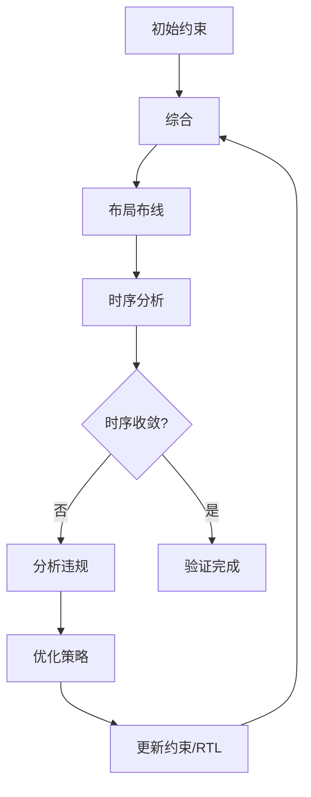

# 约束验证与调试

## 目录

1. [1. 时序报告分析](%E7%BA%A6%E6%9D%9F%E9%AA%8C%E8%AF%81%E4%B8%8E%E8%B0%83%E8%AF%95.md#1.%20时序报告分析)
2. [2. 约束检查清单](%E7%BA%A6%E6%9D%9F%E9%AA%8C%E8%AF%81%E4%B8%8E%E8%B0%83%E8%AF%95.md#2.%20约束检查清单)
3. [3. 常见问题与解决方案](%E7%BA%A6%E6%9D%9F%E9%AA%8C%E8%AF%81%E4%B8%8E%E8%B0%83%E8%AF%95.md#3.%20常见问题与解决方案)
4. [4. 调试工具与技巧](%E7%BA%A6%E6%9D%9F%E9%AA%8C%E8%AF%81%E4%B8%8E%E8%B0%83%E8%AF%95.md#4.%20调试工具与技巧)
5. [5. 时序收敛策略](%E7%BA%A6%E6%9D%9F%E9%AA%8C%E8%AF%81%E4%B8%8E%E8%B0%83%E8%AF%95.md#5.%20时序收敛策略)
6. [6. 验证流程](%E7%BA%A6%E6%9D%9F%E9%AA%8C%E8%AF%81%E4%B8%8E%E8%B0%83%E8%AF%95.md#6.%20验证流程)
7. [7. 最佳实践](%E7%BA%A6%E6%9D%9F%E9%AA%8C%E8%AF%81%E4%B8%8E%E8%B0%83%E8%AF%95.md#7.%20最佳实践)
8. [8. 参考资料](%E7%BA%A6%E6%9D%9F%E9%AA%8C%E8%AF%81%E4%B8%8E%E8%B0%83%E8%AF%95.md#8.%20参考资料)

---

## 1. 时序报告分析

### 1.1 生成时序报告

#### 基本时序报告
```tcl
# 生成建立时间报告
report_timing -delay_type max -max_paths 100 -slack_less_than 0.0 -file setup_violations.rpt

# 生成保持时间报告
report_timing -delay_type min -max_paths 100 -slack_less_than 0.0 -file hold_violations.rpt

# 生成时序摘要报告
report_timing_summary -warn_on_violation -max_paths 10 -file timing_summary.rpt

# 生成时钟域交互报告
report_clock_interaction -delay_type min_max -significant_digits 3 -file clock_interaction.rpt
```

#### 详细路径分析
```tcl
# 分析特定路径的时序
report_timing -from [get_registers reg_a] -to [get_registers reg_b] -delay_type max

# 分析关键时钟域的时序
report_timing -through [get_clocks sys_clk] -max_paths 50

# 分析跨时钟域路径
report_timing -from [get_clocks clk_a] -to [get_clocks clk_b] -max_paths 20
```

#### 约束覆盖率报告
```tcl
# 检查约束覆盖率
check_timing -verbose -file timing_check.rpt

# 生成未约束路径报告
report_timing -unconstrained_paths -max_paths 100 -file unconstrained.rpt

# 检查时钟定义
report_clocks -file clocks_report.rpt
```

### 1.2 关键时序指标解读

#### 1. 时序余量指标
- **WNS (Worst Negative Slack)**：最差负时序余量，必须 ≥ 0
- **TNS (Total Negative Slack)**：总负时序余量，应该 = 0
- **WHS (Worst Hold Slack)**：最差保持时序余量，必须 ≥ 0
- **THS (Total Hold Slack)**：总保持时序余量，应该 = 0

#### 2. 时序路径分析
```
Path Type: Setup (Max at Slow Process Corner)
Slack (MET): 0.234ns (required time - arrival time)

Data Path Delay: 4.766ns (logic 1.234ns (25.9%) route 3.532ns (74.1%))
Logic Levels: 3
Clock Path Skew: 0.123ns

Source: reg_a/C (rising edge-triggered flip-flop)
Destination: reg_b/D (rising edge-triggered flip-flop)
```

#### 3. 时序违规分类
- **Setup Violation**: 数据到达时间 > 要求时间
- **Hold Violation**: 数据保持时间 < 要求保持时间
- **Recovery Violation**: 异步信号恢复时间不足
- **Removal Violation**: 异步信号移除时间不足

### 1.3 时序报告解读技巧

#### 1. 识别关键路径
```tcl
# 找出最差的10条路径
report_timing -delay_type max -max_paths 10 -sort_by slack

# 分析逻辑层数过多的路径
report_timing -logic_levels 8 -max_paths 50
```

#### 2. 分析路径延迟构成
- **Logic Delay**: 逻辑门延迟，通常占20-30%
- **Route Delay**: 布线延迟，通常占70-80%
- **Clock Skew**: 时钟偏移，应尽量最小

#### 3. 时钟域分析
```tcl
# 检查时钟域交互
report_clock_interaction -significant_digits 3

# 分析时钟不确定性
report_clock_networks -verbose
```

---

## 2. 约束检查清单

### 2.1 时钟约束检查

#### 基本时钟约束
- [ ] 所有输入时钟都已正确定义
- [ ] 时钟周期设置符合设计要求
- [ ] 时钟不确定性已设置（jitter + skew）
- [ ] 差分时钟已正确约束

#### 衍生时钟约束
- [ ] PLL/MMCM 输出时钟已定义
- [ ] 分频时钟已正确约束
- [ ] 时钟选择器输出已约束
- [ ] 门控时钟已处理

#### 时钟域关系
- [ ] 异步时钟域已通过时钟组隔离
- [ ] 同步时钟域关系已正确设置
- [ ] 虚拟时钟已定义（如需要）

### 2.2 输入/输出约束检查

#### 输入约束
- [ ] 所有输入端口都有输入延迟约束
- [ ] 输入延迟值符合外部器件规格
- [ ] 时钟相关的输入延迟已设置
- [ ] 最大/最小延迟都已约束

#### 输出约束
- [ ] 所有输出端口都有输出延迟约束
- [ ] 输出延迟值符合外部器件要求
- [ ] 负载约束已设置
- [ ] 驱动强度已配置

#### 双向信号约束
- [ ] 双向端口的输入/输出延迟都已设置
- [ ] 三态控制信号已正确约束
- [ ] 总线争用已避免

### 2.3 例外约束检查

#### 伪路径约束
- [ ] 跨异步时钟域路径已设为伪路径
- [ ] 静态配置信号已设为伪路径
- [ ] 测试/调试路径已设为伪路径
- [ ] 互斥路径已正确标识

#### 多周期路径约束
- [ ] 复杂组合逻辑路径已设置多周期
- [ ] 周期数设置合理
- [ ] Setup 和 Hold 约束都已设置
- [ ] 跨时钟域多周期路径已处理

#### 最大/最小延迟约束
- [ ] 异步路径已设置延迟约束
- [ ] 握手信号延迟已约束
- [ ] 关键控制信号延迟已限制

### 2.4 物理约束检查

#### 引脚约束
- [ ] 所有端口都已分配引脚
- [ ] I/O 标准设置正确
- [ ] 驱动强度和负载匹配
- [ ] 差分对引脚正确配对

#### 区域约束
- [ ] 关键模块已进行区域约束
- [ ] 时钟域已合理分布
- [ ] 资源利用率平衡
- [ ] 关键路径已优化布局

---

## 3. 常见问题与解决方案

### 3.1 时钟相关问题

#### 问题1：时钟域交叉违规
**现象**：报告显示跨时钟域路径存在时序违规

**诊断方法**：
```tcl
# 检查时钟域交互
report_clock_interaction

# 分析跨时钟域路径
report_timing -from [get_clocks clk_a] -to [get_clocks clk_b]
```

**解决方案**：
```tcl
# 方案1：设置为伪路径
set_false_path -from [get_clocks clk_a] -to [get_clocks clk_b]

# 方案2：使用时钟组隔离
set_clock_groups -asynchronous -group [get_clocks clk_a] -group [get_clocks clk_b]

# 方案3：添加同步器电路（在 RTL 中实现）
```

#### 问题2：时钟不确定性设置不当
**现象**：时序余量过紧或过松

**解决方案**：
```tcl
# 重新设置时钟不确定性
set_clock_uncertainty -setup 0.2 [get_clocks sys_clk]
set_clock_uncertainty -hold 0.1 [get_clocks sys_clk]

# 为不同时钟域设置不同的不确定性
set_clock_uncertainty -from [get_clocks clk_a] -to [get_clocks clk_b] 0.3
```

### 3.2 输入/输出约束问题

#### 问题1：输入/输出延迟设置错误
**现象**：接口信号时序违规

**诊断方法**：
```tcl
# 检查输入/输出约束
report_timing -from [get_ports data_in[*]]
report_timing -to [get_ports data_out[*]]
```

**解决方案**：
```tcl
# 重新评估外部器件时序参数
# 调整输入延迟约束
set_input_delay -clock [get_clocks sys_clk] -max 3.0 [get_ports data_in[*]]
set_input_delay -clock [get_clocks sys_clk] -min 1.0 [get_ports data_in[*]]

# 调整输出延迟约束
set_output_delay -clock [get_clocks sys_clk] -max 2.0 [get_ports data_out[*]]
set_output_delay -clock [get_clocks sys_clk] -min 0.5 [get_ports data_out[*]]
```

#### 问题2：虚拟时钟使用不当
**现象**：接口时序分析不准确

**解决方案**：
```tcl
# 创建与外部器件匹配的虚拟时钟
create_clock -period 8.0 -name virt_clk

# 使用虚拟时钟约束接口
set_input_delay -clock virt_clk -max 2.0 [get_ports ext_data[*]]
set_output_delay -clock virt_clk -max 1.5 [get_ports ext_ctrl[*]]
```

### 3.3 时序收敛问题

#### 问题1：关键路径时序违规
**现象**：WNS < 0，存在建立时间违规

**解决方案**：
1. **RTL 优化**：
```verilog
// 插入流水线寄存器
always @(posedge clk) begin
    stage1_reg <= complex_logic_part1;
    stage2_reg <= stage1_reg + complex_logic_part2;
    result <= stage2_reg;
end
```

2. **约束优化**：
```tcl
# 设置多周期路径
set_multicycle_path 2 -setup -from [get_registers mult_a[*]] -to [get_registers mult_result[*]]
```

3. **物理优化**：
```tcl
# 使用区域约束
create_pblock pblock_critical
add_cells_to_pblock pblock_critical [get_cells critical_path/*]
resize_pblock pblock_critical -add {SLICE_X20Y20:SLICE_X40Y40}
```

#### 问题2：保持时间违规
**现象**：WHS < 0，存在保持时间违规

**解决方案**：
```tcl
# 添加最小延迟约束
set_min_delay 0.5 -from [get_registers reg_a] -to [get_registers reg_b]

# 调整多周期路径的保持约束
set_multicycle_path 1 -hold -from [get_registers mult_a[*]] -to [get_registers mult_result[*]]
```

### 3.4 约束冲突问题

#### 问题1：约束优先级冲突
**现象**：工具报告约束冲突

**解决方案**：
```tcl
# 检查约束冲突
check_timing -verbose

# 设置约束优先级
set_property PRIORITY 1 [get_timing_paths -from [get_clocks clk_a]]
```

#### 问题2：过度约束
**现象**：约束过于严格，无法实现

**解决方案**：
1. 重新评估约束的必要性
2. 放宽非关键路径的约束
3. 优化设计架构

---

## 4. 调试工具与技巧

### 4.1 时序分析工具

#### Vivado 时序分析器
```tcl
# 启动时序分析器
start_gui
open_checkpoint post_route.dcp

# 交互式路径分析
select_objects [get_timing_paths -max_paths 1 -slack_less_than 0]
```

#### 时序路径追踪
```tcl
# 追踪特定网络
highlight_objects [get_nets critical_net]

# 显示路径延迟分解
report_timing -delay_type max -path_type summary
```

### 4.2 调试技巧

#### 1. 增量调试
```tcl
# 逐步添加约束，观察影响
source basic_constraints.xdc
run_implementation
report_timing_summary

source additional_constraints.xdc
run_implementation
report_timing_summary
```

#### 2. 约束敏感性分析
```tcl
# 测试不同约束值的影响
set_clock_uncertainty 0.1 [get_clocks sys_clk]
run_implementation
set timing_result_1 [get_property SLACK [get_timing_paths -max_paths 1]]

set_clock_uncertainty 0.2 [get_clocks sys_clk]
run_implementation
set timing_result_2 [get_property SLACK [get_timing_paths -max_paths 1]]
```

#### 3. 关键路径优化
```tcl
# 识别瓶颈
report_timing -delay_type max -max_paths 1 -path_type summary

# 分析逻辑层数
report_timing -logic_levels 6 -max_paths 20

# 检查高扇出网络
report_high_fanout_nets -max_nets 10
```

### 4.3 自动化调试脚本

#### 约束检查脚本
```tcl
proc check_constraints {} {
    puts "=== Constraint Check Report ==="
    
    # 检查未约束的时钟
    set unconstrained_clocks [get_clocks -filter {IS_USER_DEFINED == FALSE}]
    if {[llength $unconstrained_clocks] > 0} {
        puts "Warning: Unconstrained clocks found"
    }
    
    # 检查未约束的端口
    set unconstrained_inputs [get_ports -filter {DIRECTION == IN && INPUT_DELAY == ""}]
    set unconstrained_outputs [get_ports -filter {DIRECTION == OUT && OUTPUT_DELAY == ""}]
    
    puts "Unconstrained input ports: [llength $unconstrained_inputs]"
    puts "Unconstrained output ports: [llength $unconstrained_outputs]"
    
    # 检查时序违规
    set setup_violations [get_timing_paths -slack_less_than 0 -delay_type max]
    set hold_violations [get_timing_paths -slack_less_than 0 -delay_type min]
    
    puts "Setup violations: [llength $setup_violations]"
    puts "Hold violations: [llength $hold_violations]"
}
```

---

## 5. 时序收敛策略

### 5.1 分层收敛方法

#### 1. 自顶向下方法
```
1. 顶层时钟约束
2. 主要接口约束
3. 模块间约束
4. 模块内约束
5. 细节优化
```

#### 2. 自底向上方法
```
1. 关键模块约束
2. 模块间接口
3. 顶层集成
4. 全局优化
```

### 5.2 迭代优化流程

#### 基本流程


#### 优化策略选择
1. **约束优化**：调整时序约束
2. **RTL 优化**：修改设计代码
3. **物理优化**：调整布局布线
4. **工具优化**：调整工具设置

### 5.3 收敛技巧

#### 1. 关键路径优先
```tcl
# 识别最关键的路径
set critical_paths [get_timing_paths -max_paths 10 -slack_less_than 0]

# 优先解决最差的违规
foreach path $critical_paths {
    # 分析并优化每条路径
}
```

#### 2. 分阶段收敛
```tcl
# 阶段1：解决严重违规（slack < -1ns）
# 阶段2：解决中等违规（-1ns < slack < -0.1ns）
# 阶段3：解决轻微违规（-0.1ns < slack < 0ns）
```

#### 3. 资源与时序平衡
- 在时序和资源使用之间找到平衡点
- 避免过度优化导致资源浪费
- 考虑功耗和面积约束

---

## 6. 验证流程

### 6.1 约束验证步骤

#### 1. 语法检查
```tcl
# 检查约束文件语法
check_timing -verbose -file timing_check.rpt

# 验证约束覆盖率
report_timing -unconstrained_paths -max_paths 100
```

#### 2. 时序验证
```tcl
# 生成完整时序报告
report_timing_summary -delay_type min_max -report_unconstrained

# 检查时钟域交互
report_clock_interaction -delay_type min_max
```

#### 3. 功能验证
- 后仿真验证
- 硬件在环测试
- 边界条件测试

### 6.2 验证清单

#### 约束完整性
- [ ] 所有时钟都已约束
- [ ] 所有 I/O 都已约束
- [ ] 跨时钟域路径已处理
- [ ] 例外路径已标识

#### 时序正确性
- [ ] WNS ≥ 0
- [ ] TNS = 0
- [ ] WHS ≥ 0
- [ ] THS = 0

#### 功能正确性
- [ ] 后仿真通过
- [ ] 硬件测试通过
- [ ] 边界条件验证
- [ ] 长时间稳定性测试

### 6.3 回归测试

#### 自动化测试脚本
```tcl
proc run_timing_regression {} {
    # 运行完整的实现流程
    run_synthesis
    run_implementation
    
    # 生成时序报告
    report_timing_summary -file timing_regression.rpt
    
    # 检查时序收敛
    set wns [get_property SLACK [get_timing_paths -delay_type max -max_paths 1]]
    set whs [get_property SLACK [get_timing_paths -delay_type min -max_paths 1]]
    
    if {$wns >= 0 && $whs >= 0} {
        puts "PASS: Timing constraints met"
        return 1
    } else {
        puts "FAIL: Timing violations detected"
        return 0
    }
}
```

---

## 7. 最佳实践

### 7.1 约束编写原则

1. **完整性**：确保所有信号都有适当的约束
2. **准确性**：约束值应基于实际硬件规格
3. **可维护性**：使用清晰的注释和组织结构
4. **可验证性**：约束应该可以通过仿真和测试验证

### 7.2 调试策略

1. **系统性方法**：按照固定的流程进行调试
2. **增量调试**：逐步添加约束，观察影响
3. **工具辅助**：充分利用 EDA 工具的分析功能
4. **文档记录**：记录调试过程和解决方案

### 7.3 团队协作

1. **约束规范**：建立团队统一的约束编写规范
2. **代码审查**：对约束文件进行同行评审
3. **知识共享**：建立约束知识库和最佳实践
4. **工具培训**：确保团队成员熟练使用调试工具

### 7.4 持续改进

1. **性能监控**：持续监控设计的时序性能
2. **约束优化**：定期审查和优化约束
3. **工具更新**：跟踪 EDA 工具的新功能
4. **经验总结**：总结项目经验，形成最佳实践

---

## 8. 参考资料

### 官方文档
- Xilinx UG903: Using Vivado Design Suite
- Xilinx UG906: Vivado Design Suite User Guide
- Intel Quartus Prime Timing Analysis
- Microsemi Timing Constraints User Guide

### 推荐工具
- Vivado Timing Analyzer
- TimeQuest Timing Analyzer
- ChipScope/ILA 调试工具
- 第三方时序分析工具

### 学习资源
- 《FPGA时序分析与约束》
- 《数字IC时序设计》
- 各厂商官方培训资料
- 在线时序分析课程

### 社区资源
- FPGA 开发者论坛
- 厂商技术支持社区
- 开源约束库和示例
- 技术博客和文章