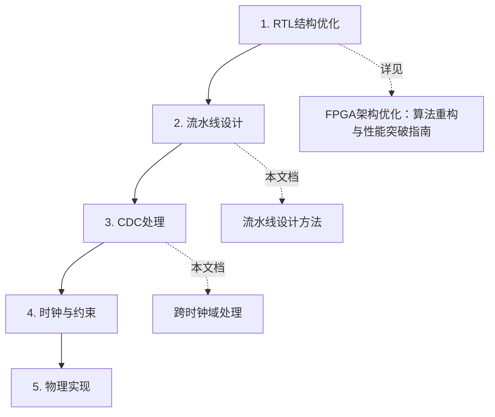
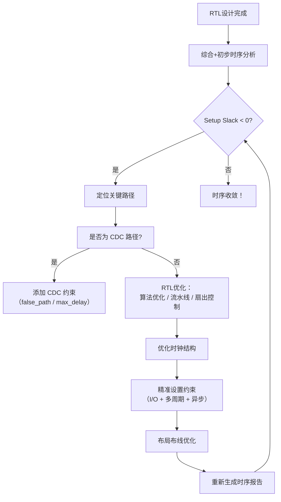

# 🔄 FPGA时序收敛：全流程方法论与实践指南

> **核心理念**：  
> **时序优化 ≠ 追求零违例，而是建立"合理裕量"的稳健设计**。

## 📚 相关文档导航
- 🏠 [时序约束学习主页](FPGA/05-时序约束/README.md) - 完整学习路径
- ⚡ [时序约束速查手册](/05-%E6%97%B6%E5%BA%8F%E7%BA%A6%E6%9D%9F/99-%E5%8F%82%E8%80%83%E8%B5%84%E6%96%99/%E6%97%B6%E5%BA%8F%E7%BA%A6%E6%9D%9F%E9%80%9F%E6%9F%A5%E6%89%8B%E5%86%8C.md#) - 常用命令参考  
- 🔧 [时序分析GUI工具](时序分析GUI.md) - 工具使用指南
- 📝 [项目实战案例](/05-%E6%97%B6%E5%BA%8F%E7%BA%A6%E6%9D%9F/05-%E9%A1%B9%E7%9B%AE%E6%A1%88%E4%BE%8B/FPGA%E6%97%B6%E5%BA%8F%E4%BC%98%E5%8C%96%E5%AD%A6%E4%B9%A0%E7%AC%94%E8%AE%B0.md#) - 真实项目经验
- 🛠 [FPGA架构优化：算法重构与性能突破指南](/05-%E6%97%B6%E5%BA%8F%E7%BA%A6%E6%9D%9F/03-%E4%BC%98%E5%8C%96%E7%AD%96%E7%95%A5/%E7%AE%97%E6%B3%95%E9%87%8D%E6%9E%84%E4%B8%8E%E6%80%A7%E8%83%BD%E7%AA%81%E7%A0%B4.md#) - 算法与架构优化
- 🔍 [FPGA时序问题诊断：快速定位与精准修复手册](/05-%E6%97%B6%E5%BA%8F%E7%BA%A6%E6%9D%9F/03-%E4%BC%98%E5%8C%96%E7%AD%96%E7%95%A5/%E5%BF%AB%E9%80%9F%E5%AE%9A%E4%BD%8D%E4%B8%8E%E7%B2%BE%E5%87%86%E4%BF%AE%E5%A4%8D.md#) - 问题诊断与定位

---

## 🎯 一、时序目标与优先级

| 时序类型       | 作用                     | 优先级 | 目标裕量（Slack）             |
|----------------|--------------------------|--------|-------------------------------|
| **建立时间（Setup）** | 决定**最高工作频率**       | ⭐⭐⭐⭐⭐ | ≥ **15% × 时钟周期**<br>（例：100 MHz → ≥ 1.5 ns） |
| **保持时间（Hold）** | 保证数据稳定采样           | ⭐⭐     | ≥ **0.1–0.3 ns**（工具通常自动修复） |

> **"先写完整约束（时钟+IO+异步），再看报告；优先 RTL 优化（流水线+控扇出），最后才调物理实现。"**

---

## 🔍 二、诊断阶段：精准定位关键路径

### 📊 时序报告速查

| 工具          | 命令 / 路径                                 | 作用             |
| ----------- | --------------------------------------- | -------------- |
| **Vivado**  | `report_timing_summary`                 | 全局概览           |
|             | `report_timing -slack_lesser_than 0`    | 显示违例路径         |
|             | `report_timing -max_paths 20 -nworst 5` | 最差 20 条中的前 5 条 |
|             | `report_cdc`                            | **跨时钟域路径分析**   |
| **Quartus** | TimeQuest → Reports → Timing Summary    | 图形化总览          |
|             | `report_timing -to [get_pins xxx]`      | 定向分析特定终点       |

### ⚠️ 识别关键路径的三大原则

| 判断维度       | 说明 | 示例 |
|----------------|------|------|
| **路径频率**   | 是否在高频时钟域？ | 100 MHz 路径 > 10 MHz 路径 |
| **功能重要性** | 是否影响主数据流？ | 图像处理流水线 > 调试状态机 |
| **路径数量**   | 是否多条相似违例？ | 多个乘法器同时违例 → 需结构级优化 |

> 💡 **注意点**：  
> **最差 Slack ≠ 最关键路径**！  
> *例：配置寄存器 Slack = -0.5 ns（低频），高速数据路径 Slack = -0.1 ns（高频）才是真瓶颈。*

> 🔗 **详细诊断方法**：参见 [FPGA时序问题诊断：快速定位与精准修复手册](/05-%E6%97%B6%E5%BA%8F%E7%BA%A6%E6%9D%9F/03-%E4%BC%98%E5%8C%96%E7%AD%96%E7%95%A5/%E5%BF%AB%E9%80%9F%E5%AE%9A%E4%BD%8D%E4%B8%8E%E7%B2%BE%E5%87%86%E4%BF%AE%E5%A4%8D.md#) - 专项问题诊断

---

## ⚙️ 三、优化阶段：系统化策略

### 🎯 优化优先级（必须按顺序执行）





### 1️⃣ RTL结构优化（第一优先级）

> 🔗 **完整内容**：参见 [FPGA架构优化：算法重构与性能突破指南](/05-%E6%97%B6%E5%BA%8F%E7%BA%A6%E6%9D%9F/03-%E4%BC%98%E5%8C%96%E7%AD%96%E7%95%A5/%E7%AE%97%E6%B3%95%E9%87%8D%E6%9E%84%E4%B8%8E%E6%80%A7%E8%83%BD%E7%AA%81%E7%A0%B4.md#)

**核心要点**：
- **算法优化**：用移位替代乘法（↓60-95%延迟）
- **高扇出控制**：信号复制、缓冲树（↓20-50%延迟）
- **资源配置**：SRL、BRAM优化避免LUT拼接
- **并行处理**：提升吞吐量，降低单路径压力

### 2️⃣ 流水线设计（本文档重点）

#### ✅ 流水线插入原理
将长组合逻辑拆分为 N 段，每段延迟 ≈ 原延迟 / N，频率理论提升 N 倍（实际 1.5~2.5 倍）。

#### 📜 标准流水线模板
```verilog
// ❌ 单级逻辑（延迟 6 ns）
always @(posedge clk) out <= f3(f2(f1(in)));

// ✅ 3级流水（每段 ≈ 2 ns）
reg [WIDTH-1:0] stage1, stage2;
always @(posedge clk) begin
    stage1 <= f1(in);      // 第一级：基础运算
    stage2 <= f2(stage1);  // 第二级：中间处理
    out    <= f3(stage2);  // 第三级：最终输出
end
```

#### 🎯 流水线设计要点
- **插入位置**：在逻辑自然断点处，避免破坏数据依赖
- **平衡延迟**：各级延迟尽量均匀，避免某一级成为瓶颈
- **控制信号**：同步插入相应的控制流水线
- **初始化**：考虑复位后的流水线填充时间

---

## 🌐 四、跨时钟域（CDC）与时序例外

### 1. CDC 是时序"隐形杀手"

- **表现**：时序报告无违例，但上板随机出错
- **根源**：亚稳态未处理、路径未正确约束

#### ✅ CDC 常见安全结构
| 场景 | 推荐方案 | 延迟特性 | 复杂度 |
|------|----------|----------|--------|
| 单 bit 信号 | 两级触发器同步器 | 2个目标时钟周期 | ⭐ |
| 多 bit 信号 | 异步 FIFO / 握手协议 | 4-6个时钟周期 | ⭐⭐⭐ |
| 高速数据流 | 格雷码 + FIFO | 1-2个时钟周期 | ⭐⭐⭐⭐ |
| 脉冲信号 | 脉冲同步器 | 3-4个时钟周期 | ⭐⭐ |

#### 📜 双级同步器标准模板
```verilog
// 标准双级同步器（单bit信号）
reg sync_ff1, sync_ff2;
always @(posedge clk_dst or negedge rst_n) begin
    if (!rst_n) begin
        sync_ff1 <= 1'b0;
        sync_ff2 <= 1'b0;
    end else begin
        sync_ff1 <= async_signal;
        sync_ff2 <= sync_ff1;
    end
end
assign sync_signal = sync_ff2;
```

#### ⚠️ 时序约束原则
- **不要对 CDC 路径做 setup/hold 分析**
- **应使用时序例外**：

```tcl
# Vivado：单 bit 同步器路径
set_false_path -from [get_clocks clk_a] -to [get_clocks clk_b]

# 或更精确：仅针对同步器输入
set_max_delay 5.0 -from [get_pins src_ff/Q] -to [get_pins sync_ff1/D]
set_min_delay 0.5 -from [get_pins src_ff/Q] -to [get_pins sync_ff1/D]
```

### 2. 多周期路径（Multicycle Path）

#### ✅ 适用场景
- 控制信号更新慢于数据时钟（如每 2 周期更新一次）
- 状态机输出驱动寄存器

#### 📜 正确设置方式
```tcl
# 控制信号每 2 个 clk 周期更新一次
set_multicycle_path 2 -setup -from [get_pins ctrl_gen] -to [get_pins ctrl_reg]
set_multicycle_path 1 -hold  -from [get_pins ctrl_gen] -to [get_pins ctrl_reg]
```

> ❗ **关键**：必须同时设置 `-setup` 和 `-hold`，否则 hold 检查会出错！

---

## ⏱️ 五、系统级优化：时钟与约束

### 1. 时钟树优化（CTS）
| 工具      | 设置路径 |
|-----------|--------|
| Vivado    | `set_clock_groups -asynchronous`（异步时钟）<br>启用 CTS |
| Quartus   | Assignments → Timing Constraints → Clock Settings → Enable CTS |

### 2. I/O 延迟约束（必须基于 datasheet！）

```tcl
# Vivado 示例：外部 ADC 接口
create_clock -name sys_clk -period 10.0 [get_ports clk]

# 输入建立时间：数据需在上升沿前 2.5 ns 稳定
set_input_delay -clock sys_clk -max 2.5 [get_ports adc_data]

# 输入保持时间：数据需在上升沿后 1.0 ns 保持
set_input_delay -clock sys_clk -min -1.0 [get_ports adc_data]
```

### 3. 虚假路径（False Path）—— **慎用！**

#### ✅ 正确场景
- 异步复位释放路径
- 固定模式选择（如测试/正常模式）
- CDC 路径（见上文）

```tcl
# ✅ 正确：异步复位路径
set_false_path -from [get_pins reset_reg] -to [get_pins data_reg]

# ❌ 错误：误标关键输出路径 → 上板崩溃
# set_false_path -to [get_ports output]  # 绝对禁止！
```

---

## 🔁 六、系统化优化流程（迭代闭环）



> ✅ **关键原则**：**每次只改一处，验证后再改下一处**。

---

## 📌 七、黄金法则（必须牢记！）

1. **先看报告，再动手** → 盲目优化 = 浪费时间  
2. **流水线是第一武器** → 90% 问题靠它解决  
3. **约束不准，一切白干** → I/O 延迟必须来自 datasheet  
4. **伪路径是双刃剑** → 用错 = 系统崩溃  
5. **迭代是唯一路径** → 一次优化 rarely 足够  
6. **裕量比零违例更重要** → 留 15% 余量保量产稳定性  
7. **CDC 必须显式处理** → 否则上板必出问题  
8. **永远用 clk_en，不用 gated clock**

---

## 📎 附录：时序收敛 Checklist

✅ **请逐项核对**：

- [ ] 主时钟、生成时钟、虚拟时钟均已定义  
- [ ] I/O 延迟基于器件 datasheet（非估算）  
- [ ] 所有异步路径已正确约束（CDC / false_path / max_delay）  
- [ ] 关键路径已插入流水寄存器  
- [ ] 高扇出信号 < 1000（用 `report_high_fanout_nets` 检查）  
- [ ] 未使用手动门控时钟（仅用 clk_en）  
- [ ] 多周期路径已正确设置 setup/hold  
- [ ] P&R 后时序报告已通过（非仅综合后）  
- [ ] Setup Slack ≥ 15% × Tclk  

---

# 标签  
#FPGA #时序优化 #流水线 #CDC #跨时钟域 #时序约束 #系统化方法论 #Vivado #Quartus #时序收敛