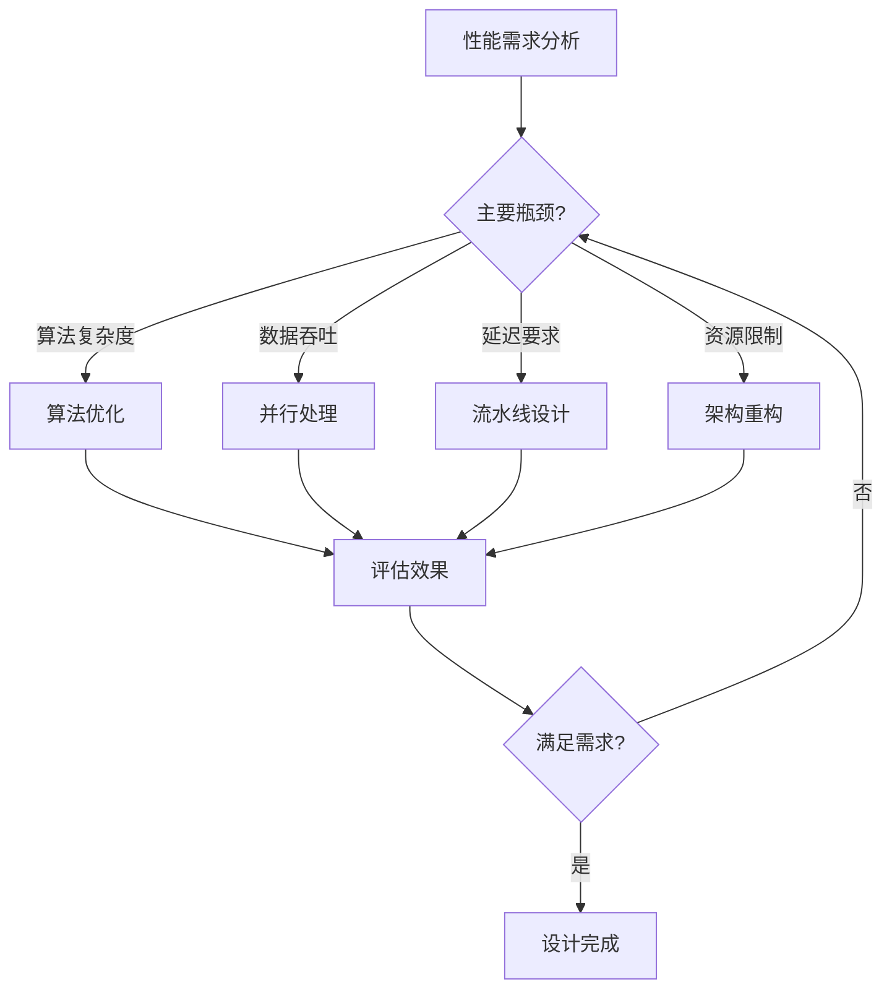

# 🛠 FPGA架构优化：算法重构与性能突破指南

> **专注领域**：算法优化、架构重构、资源配置、并行处理设计  
> **适用场景**：设计初期架构规划、性能瓶颈的根本性解决、大规模重构

## 📚 相关文档导航
- 🏠 [时序约束学习主页](FPGA/05-时序约束/README.md) - 完整学习路径
- 🔄 [FPGA时序收敛：全流程方法论与实践指南](/05-%E6%97%B6%E5%BA%8F%E7%BA%A6%E6%9D%9F/03-%E4%BC%98%E5%8C%96%E7%AD%96%E7%95%A5/%E5%85%A8%E6%B5%81%E7%A8%8B%E6%96%B9%E6%B3%95%E8%AE%BA%E4%B8%8E%E5%AE%9E%E8%B7%B5.md#) - 完整优化流程
- 🔍 [FPGA时序问题诊断：快速定位与精准修复手册](快速定位与精准修复.md### 一、📌 FMAX 基础概念) - 问题诊断与定位

---

## 🎯 一、优化策略层次结构

### 📊 优化效果对比表

| 优化层次      | 典型提升幅度  | 实施难度  | 适用阶段 | 风险等级 |
| --------- | ------- | ----- | ---- | ---- |
| **算法优化**  | 60-95%  | ⭐⭐⭐⭐  | 设计初期 | 🟢 低 |
| **架构重构**  | 30-70%  | ⭐⭐⭐⭐⭐ | 设计中期 | 🟡 中 |
| **资源配置**  | 20-50%  | ⭐⭐⭐   | 任何阶段 | 🟢 低 |
| **并行处理**  | 50-200% | ⭐⭐⭐⭐  | 设计初期 | 🟡 中 |
| **流水线插入** | 15-40%  | ⭐⭐    | 设计后期 | 🟢 低 |

> 💡 **核心理念**：**结构决定性能上限，流水线只是逼近上限的手段**

---

## 🧮 二、算法优化：从根本上降低复杂度

### 1️⃣ 乘法运算优化

#### ✅ 移位替代乘法（常数乘法）
```verilog
// ❌ 原始：通用乘法器（延迟 3-5 ns）
result <= data * 17;

// ✅ 优化：移位+加法（延迟 0.5-1 ns）
result <= (data << 4) + data;  // 16*data + data = 17*data
```

#### 📊 常见乘法常数优化表
| 乘数 | 原始实现 | 优化实现 | 延迟降低 |
|------|----------|----------|----------|
| 3 | `data * 3` | `(data << 1) + data` | 80% |
| 5 | `data * 5` | `(data << 2) + data` | 85% |
| 9 | `data * 9` | `(data << 3) + data` | 90% |
| 17 | `data * 17` | `(data << 4) + data` | 95% |
| 33 | `data * 33` | `(data << 5) + data` | 95% |

#### 🔧 分布式算术（DA）算法
适用于**固定系数**的乘累加运算：
```verilog
// 传统 FIR 滤波器（需要多个乘法器）
y = c0*x0 + c1*x1 + c2*x2 + c3*x3;

// DA 算法（仅需查找表 + 移位累加）
// 将输入按位分解，用 LUT 存储预计算结果
```

**适用场景**：
- FIR/IIR 数字滤波器
- DCT/FFT 变换
- 卷积神经网络

### 2️⃣ 除法运算优化

#### ✅ 移位替代除法（2的幂次除法）
```verilog
// ❌ 原始：除法器（延迟 10-20 ns）
quotient <= dividend / 8;

// ✅ 优化：右移（延迟 0.2 ns）
quotient <= dividend >> 3;  // 除以 8 = 右移 3 位
```

#### 🔧 倒数查找表法
```verilog
// 对于固定除数的除法：A / B = A * (1/B)
// 预计算 1/B 存储在 ROM 中
reg [15:0] reciprocal_lut [0:255];
wire [31:0] result = dividend * reciprocal_lut[divisor];
```

### 3️⃣ 三角函数与超越函数优化

#### 📜 CORDIC 算法实现
```verilog
// 用于 sin/cos/atan/sqrt 等函数
// 仅需移位和加减法，无需乘法器
module cordic_sin_cos (
    input clk,
    input [15:0] angle,
    output [15:0] sin_out,
    output [15:0] cos_out
);
    // CORDIC 迭代实现
    // 每次迭代：X' = X - Y*d*2^(-i)
    //          Y' = Y + X*d*2^(-i)
endmodule
```

#### 📊 查找表 + 插值法
```verilog
// 分段线性插值
// 存储关键点，中间值用线性插值计算
reg [15:0] sin_lut [0:90];  // 存储 0-90 度的 sin 值
wire [15:0] sin_approx = sin_lut[angle[7:0]] + 
                        (sin_lut[angle[7:0]+1] - sin_lut[angle[7:0]]) * angle[7:0];
```

---

## 🏗 三、架构重构：突破性能瓶颈

### 1️⃣ 数据流架构优化

#### ✅ 流水线 vs 并行处理选择
| 场景 | 推荐架构 | 吞吐量提升 | 延迟特性 |
|------|----------|------------|----------|
| **连续数据流** | 深度流水线 | N 倍（N=级数） | 增加 N-1 周期 |
| **批量处理** | 并行阵列 | M 倍（M=并行度） | 不变 |
| **实时响应** | 浅流水线 + 并行 | 2-4 倍 | 最小化 |

#### 📜 并行处理架构示例
```verilog
// 8 路并行 FIR 滤波器
module parallel_fir_8x (
    input clk,
    input [7:0] data_in [0:7],    // 8 路输入
    output [15:0] data_out [0:7]  // 8 路输出
);
    
    genvar i;
    generate
        for (i = 0; i < 8; i = i + 1) begin : fir_array
            fir_filter fir_inst (
                .clk(clk),
                .data_in(data_in[i]),
                .data_out(data_out[i])
            );
        end
    endgenerate
endmodule
```

### 2️⃣ 存储架构优化

#### ✅ 多端口存储器设计
```verilog
// 双端口 RAM 实现并行读写
module dual_port_ram (
    input clk,
    // 端口 A（写）
    input [9:0] addr_a,
    input [31:0] data_a,
    input we_a,
    // 端口 B（读）
    input [9:0] addr_b,
    output [31:0] data_b
);
    
    reg [31:0] memory [0:1023];
    
    always @(posedge clk) begin
        if (we_a) memory[addr_a] <= data_a;
    end
    
    assign data_b = memory[addr_b];
endmodule
```

#### 📊 存储器类型选择指南
| 存储需求 | 推荐类型 | 优势 | 注意事项 |
|----------|----------|------|----------|
| **小容量高速缓存** | 分布式 RAM | 延迟最低 | 资源消耗大 |
| **中等容量数据** | Block RAM | 平衡性能 | 端口数限制 |
| **大容量存储** | 外部 DDR | 容量大 | 延迟较高 |
| **常数数据** | ROM/LUT | 面积最小 | 只读 |

### 3️⃣ 控制逻辑优化

#### ✅ 状态机优化
```verilog
// 独热码状态机（面积换速度）
typedef enum logic [7:0] {
    IDLE    = 8'b00000001,
    LOAD    = 8'b00000010,
    CALC    = 8'b00000100,
    STORE   = 8'b00001000,
    DONE    = 8'b00010000
} state_t;

state_t current_state, next_state;

// 并行状态判断，无优先级延迟
always_comb begin
    case (1'b1)  // 独热码判断
        current_state[0]: next_state = LOAD;    // IDLE
        current_state[1]: next_state = CALC;    // LOAD
        current_state[2]: next_state = STORE;   // CALC
        current_state[3]: next_state = DONE;    // STORE
        current_state[4]: next_state = IDLE;    // DONE
        default: next_state = IDLE;
    endcase
end
```

---

## ⚙️ 四、资源配置优化

### 1️⃣ DSP 资源优化利用

#### ✅ DSP48 原语直接实例化
```verilog
// 直接使用 DSP48 原语，避免推理不准确
DSP48E1 #(
    .A_INPUT("DIRECT"),
    .B_INPUT("DIRECT"),
    .USE_MULT("MULTIPLY"),
    .USE_PATTERN_DETECT("NO_PATDET"),
    .AUTORESET_PATDET("NO_RESET")
) dsp_mult_inst (
    .CLK(clk),
    .A(a_input),      // 25-bit
    .B(b_input),      // 18-bit
    .P(product)       // 43-bit
);
```

#### 📊 DSP 资源利用策略
| 运算类型 | DSP 配置 | 性能提升 | 适用场景 |
|----------|----------|----------|----------|
| **乘法** | 单 DSP | 基准 | 基础乘法 |
| **乘累加** | DSP + 累加器 | 2x | FIR 滤波 |
| **复数乘法** | 4 DSP 并行 | 4x | FFT/调制 |
| **矩阵乘法** | DSP 阵列 | 8-16x | 神经网络 |

### 2️⃣ Block RAM 优化配置

#### ✅ 存储器位宽与深度权衡
```verilog
// 根据访问模式选择最优配置
// 配置 1：窄位宽，深存储（适合序列访问）
BRAM_SINGLE_MACRO #(
    .BRAM_SIZE("36Kb"),
    .DEVICE("7SERIES"),
    .WRITE_WIDTH(8),
    .READ_WIDTH(8)
) bram_narrow (
    .CLK(clk),
    .ADDR(addr[14:0]),  // 32K x 8
    .DI(data_in[7:0]),
    .DO(data_out[7:0])
);

// 配置 2：宽位宽，浅存储（适合并行访问）
BRAM_SINGLE_MACRO #(
    .BRAM_SIZE("36Kb"),
    .DEVICE("7SERIES"),
    .WRITE_WIDTH(64),
    .READ_WIDTH(64)
) bram_wide (
    .CLK(clk),
    .ADDR(addr[11:0]),  // 4K x 64
    .DI(data_in[63:0]),
    .DO(data_out[63:0])
);
```

### 3️⃣ 移位寄存器（SRL）优化

#### ✅ SRL 替代寄存器链
```verilog
// ❌ 原始：长寄存器链（消耗大量 FF）
reg [7:0] delay_chain [0:31];
always @(posedge clk) begin
    delay_chain[0] <= data_in;
    for (int i = 1; i < 32; i++) begin
        delay_chain[i] <= delay_chain[i-1];
    end
end

// ✅ 优化：SRL 实现（仅消耗 LUT）
(* shreg_extract = "yes" *)
reg [7:0] srl_delay [0:31];
always @(posedge clk) begin
    srl_delay <= {srl_delay[30:0], data_in};
end
```

---

## 🔄 五、并行处理设计模式

### 1️⃣ 数据并行模式

#### ✅ SIMD（单指令多数据）架构
```verilog
// 8 路并行加法器
module simd_adder_8x (
    input clk,
    input [31:0] a_vec [0:7],
    input [31:0] b_vec [0:7],
    output [31:0] sum_vec [0:7]
);
    
    genvar i;
    generate
        for (i = 0; i < 8; i = i + 1) begin : parallel_add
            always @(posedge clk) begin
                sum_vec[i] <= a_vec[i] + b_vec[i];
            end
        end
    endgenerate
endmodule
```

### 2️⃣ 任务并行模式

#### ✅ 生产者-消费者模式
```verilog
// 异步 FIFO 连接不同处理模块
module producer_consumer_system (
    input clk_prod, clk_cons,
    input rst_n,
    input [31:0] data_in,
    output [31:0] data_out
);
    
    wire [31:0] fifo_data;
    wire fifo_empty, fifo_full;
    
    // 生产者模块
    producer prod_inst (
        .clk(clk_prod),
        .data_in(data_in),
        .fifo_data(fifo_data),
        .fifo_full(fifo_full)
    );
    
    // 异步 FIFO
    async_fifo fifo_inst (
        .wr_clk(clk_prod),
        .rd_clk(clk_cons),
        .din(fifo_data),
        .dout(processed_data),
        .empty(fifo_empty),
        .full(fifo_full)
    );
    
    // 消费者模块
    consumer cons_inst (
        .clk(clk_cons),
        .fifo_data(processed_data),
        .fifo_empty(fifo_empty),
        .data_out(data_out)
    );
endmodule
```

### 3️⃣ 流水线并行模式

#### ✅ 深度流水线设计
```verilog
// 8 级乘累加流水线
module mac_pipeline_8stage (
    input clk, rst_n,
    input [15:0] a, b,
    input [31:0] c,
    output [31:0] result
);
    
    // 流水线寄存器
    reg [15:0] a_reg [0:3], b_reg [0:3];
    reg [31:0] mult_reg [0:1];
    reg [31:0] c_reg [0:6];
    reg [31:0] add_reg [0:1];
    
    always @(posedge clk) begin
        if (!rst_n) begin
            // 复位逻辑
        end else begin
            // 第 1-4 级：输入缓冲
            a_reg[0] <= a;
            b_reg[0] <= b;
            for (int i = 1; i < 4; i++) begin
                a_reg[i] <= a_reg[i-1];
                b_reg[i] <= b_reg[i-1];
            end
            
            // 第 5-6 级：乘法
            mult_reg[0] <= a_reg[3] * b_reg[3];
            mult_reg[1] <= mult_reg[0];
            
            // 第 7-8 级：加法
            add_reg[0] <= mult_reg[1] + c_reg[5];
            result <= add_reg[0];
            
            // C 输入的延迟匹配
            c_reg[0] <= c;
            for (int i = 1; i < 7; i++) begin
                c_reg[i] <= c_reg[i-1];
            end
        end
    end
endmodule
```

---

## 📊 六、性能评估与权衡

### 1️⃣ 面积-速度权衡分析

#### 📈 优化效果量化表
| 优化技术 | 面积变化 | 速度提升 | 功耗变化 | 适用场景 |
|----------|----------|----------|----------|----------|
| **算法优化** | -50% ~ +20% | +60% ~ +95% | -30% ~ -60% | 所有场景 |
| **并行处理** | +100% ~ +400% | +50% ~ +200% | +80% ~ +300% | 高吞吐需求 |
| **深度流水线** | +20% ~ +50% | +15% ~ +40% | +10% ~ +30% | 连续数据流 |
| **资源复用** | -30% ~ -60% | -20% ~ +10% | -20% ~ -40% | 面积受限 |

### 2️⃣ 设计决策矩阵

#### ✅ 应用场景导向的优化策略
| 应用类型 | 主要约束 | 推荐策略 | 次要策略 |
|----------|----------|----------|----------|
| **高速信号处理** | 延迟 | 深度流水线 | 算法优化 |
| **实时控制** | 响应时间 | 并行处理 | 浅流水线 |
| **批量计算** | 吞吐量 | 大规模并行 | 算法优化 |
| **嵌入式应用** | 面积/功耗 | 算法优化 | 资源复用 |

---

## 🎯 七、实战案例分析

### 📋 案例1：FFT 处理器优化

#### 🔍 原始设计问题
- 单路 1024 点 FFT，处理时间 1024 周期
- 目标：提升 8 倍吞吐量

#### 🛠 优化方案
```verilog
// 8 路并行 FFT 处理器
module parallel_fft_8x (
    input clk,
    input [15:0] data_in [0:7][0:127],  // 8 路 × 128 点
    output [15:0] data_out [0:7][0:127]
);
    
    genvar i;
    generate
        for (i = 0; i < 8; i = i + 1) begin : fft_array
            fft_128pt fft_inst (
                .clk(clk),
                .data_in(data_in[i]),
                .data_out(data_out[i])
            );
        end
    endgenerate
endmodule
```

#### 📊 优化结果
- **吞吐量**：8 倍提升（128 周期处理 8×128 点）
- **面积**：6 倍增加（共享旋转因子 LUT）
- **延迟**：降低至 128 周期

### 📋 案例2：图像滤波器优化

#### 🔍 原始设计问题
- 3×3 卷积滤波器，逐像素处理
- 1920×1080 图像需要 2M 周期

#### 🛠 优化方案
```verilog
// 行并行 + 列流水线架构
module parallel_conv_filter (
    input clk,
    input [7:0] pixel_in [0:2],     // 3 行并行输入
    output [7:0] pixel_out
);
    
    // 3×3 卷积核
    wire [7:0] kernel [0:2][0:2] = '{
        '{1, 2, 1},
        '{2, 4, 2},
        '{1, 2, 1}
    };
    
    // 并行乘累加
    wire [15:0] conv_result;
    assign conv_result = 
        kernel[0][0] * line_buffer[0][0] + kernel[0][1] * line_buffer[0][1] + kernel[0][2] * line_buffer[0][2] +
        kernel[1][0] * line_buffer[1][0] + kernel[1][1] * line_buffer[1][1] + kernel[1][2] * line_buffer[1][2] +
        kernel[2][0] * line_buffer[2][0] + kernel[2][1] * line_buffer[2][1] + kernel[2][2] * line_buffer[2][2];
    
    assign pixel_out = conv_result[15:8];  // 归一化输出
endmodule
```

#### 📊 优化结果
- **吞吐量**：每周期处理 1 像素（2M 倍提升）
- **延迟**：3 周期流水线延迟
- **面积**：增加 9 个乘法器 + 行缓存

---

## 💡 八、设计指导原则

### 🎯 优化决策流程


### 📋 设计检查清单

#### ✅ 算法层面
- [ ] 是否存在可优化的乘除法运算？
- [ ] 是否可以用查找表替代复杂函数？
- [ ] 是否可以降低算法复杂度？
- [ ] 是否存在冗余计算？

#### ✅ 架构层面
- [ ] 数据流是否最优？
- [ ] 是否需要并行处理？
- [ ] 存储器访问是否高效？
- [ ] 控制逻辑是否简化？

#### ✅ 资源层面
- [ ] DSP 资源是否充分利用？
- [ ] Block RAM 配置是否合理？
- [ ] 是否可以用 SRL 替代寄存器链？
- [ ] 时钟域是否最优？

---

## 🎯 九、总结与展望

### 💡 核心要点回顾
1. **算法优化是第一优先级** - 从根本上降低复杂度
2. **架构决定性能上限** - 合理的并行和流水线设计
3. **资源配置要匹配需求** - 避免过度设计和资源浪费
4. **权衡分析指导决策** - 面积、速度、功耗的平衡

### 🔮 高级优化方向
- **动态重配置**：运行时调整算法参数
- **近似计算**：精度换取性能的权衡
- **异构计算**：CPU+FPGA 协同处理
- **AI 加速**：专用神经网络加速器设计

> 🔗 **后续学习**：掌握本文档的结构优化后，可参考 [FPGA时序收敛：全流程方法论与实践指南](/05-%E6%97%B6%E5%BA%8F%E7%BA%A6%E6%9D%9F/03-%E4%BC%98%E5%8C%96%E7%AD%96%E7%95%A5/%E5%85%A8%E6%B5%81%E7%A8%8B%E6%96%B9%E6%B3%95%E8%AE%BA%E4%B8%8E%E5%AE%9E%E8%B7%B5.md#) 进行流水线细化和时序收敛

---

# 标签
#FPGA #RTL优化 #算法优化 #架构设计 #并行处理 #DSP #BlockRAM #性能优化 #设计方法论
