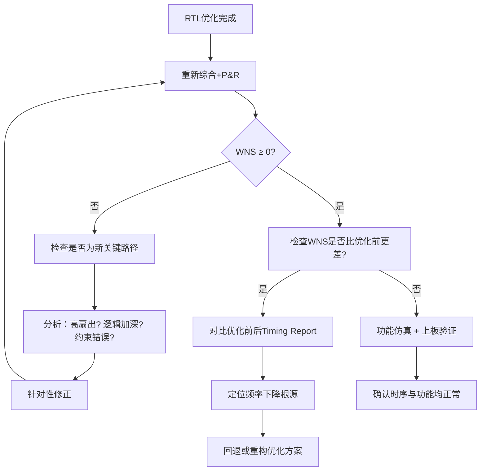

# ❓ 为什么优化 RTL 后最大频率反而降低了？

> **这不是“优化失败”，而是“优化策略失衡”**。  
> **真正的时序优化 = 逻辑结构 + 时序约束 + 物理实现的协同平衡**。

---

## 🔍 一、根本原因：五大典型陷阱

### 1️⃣ **关键路径被“转移”而非“消除”**
- **现象**：原关键路径 Slack 改善，但**另一条原本次要路径成为新瓶颈**
- **根源**：仅针对 Top-N 违例路径优化，忽略全局时序分布
- **类比**：堵住漏水的 A 管，结果 B 管爆了

> ✅ **验证方法**：  
> Vivado：`report_timing -max_paths 100 -nworst 10`  
> Quartus：查看 Timing Analyzer 中 **All Failing Paths**

---

### 2️⃣ **引入高扇出信号（High Fanout Net）**
- **机制**：为复用逻辑或控制信号，使某信号驱动大量负载
- **后果**：布线延迟剧增（LUT → 布线 → FF 路径变长）
- **数据参考**：扇出 > 1000 时，布线延迟可能占路径总延迟 40%+

> 📌 **检查命令**：  
> - Vivado：`report_high_fanout_nets -max_nets 10`  
> - Quartus：`Report → Fanout` 或 Timing Report 中标红项

---

### 3️⃣ **错误流水线：增加逻辑级数而非拆分**
- **误区**：在路径末端“补寄存器”，未真正拆分组合逻辑
- **后果**：
  - 当前路径 Slack 改善
  - **前级路径逻辑深度增加**，成为新关键路径
- **反例**：
  ```verilog
  // ❌ 伪流水：仅延迟输出，未拆分逻辑
  reg temp;
  always @(posedge clk) begin
    temp <= (a & b) | (c ^ d);  // 仍为4级组合逻辑
    out <= temp;
  end
  ```

> ✅ **正确做法**：在**逻辑中间点**插入寄存器，真正拆分 LUT 链

---

### 4️⃣ **时序约束误用（尤其是 False Path）**
- **高危操作**：将实际工作的路径误标为 `set_false_path`
- **后果**：
  - 工具跳过时序分析 → 该路径可能严重违例
  - 上板后出现**间歇性功能错误**（亚稳态）
- **典型场景**：
  - 误标 CDC 路径但未加同步器
  - 将多周期控制信号路径设为 false path

> ⚠️ **黄金法则**：  
> **False Path ≠ “我不关心”，而是 “此路径永不同时有效”**

---

### 5️⃣ **资源碎片化导致布线恶化**
- **机制**：优化后 LUT/FF 使用率上升 → 布局更分散 → 布线绕远
- **影响**：即使逻辑延迟降低，**布线延迟增幅更大**
- **高频设计尤甚**：>200 MHz 时，布线延迟占比超 50%

> 💡 **缓解策略**：
> - 使用 `pblock` 锁定关键模块区域
> - 启用 `place_design -directive Explore`（Vivado）
> - 控制模块粒度，避免“小而散”

---

## 📊 二、优化前后频率变化典型场景

| 场景 | 优化前 | 优化后 | 根本原因 |
|------|--------|--------|----------|
| A | 200 MHz | 180 MHz | 插入寄存器位置错误，前级逻辑加深 |
| B | 200 MHz | 190 MHz | 主路径改善，但引入高扇出信号 |
| C | 200 MHz | 150 MHz | 误设 false path，隐藏关键路径 |
| D | 200 MHz | 220 MHz | 有效流水 + 扇出控制 + 约束精准 |

> ✅ **关键认知**：**频率下降 ≠ 优化无效，而是暴露了更深层问题**

---

## 🛠️ 三、正确优化流程：避免“越优越差”

### ✅ 步骤 1：**全局时序基线分析**
- 不只看 WNS，还要看 **TNS、WHS、路径分布**
- 识别所有潜在瓶颈（包括 Slack > 0 但接近 0 的路径）

### ✅ 步骤 2：**优化后必须重新全路径分析**
- 重新运行 P&R（非仅综合）
- 检查 **Timing Summary + High Fanout + CDC Report**

### ✅ 步骤 3：**验证优化是否“真正拆分逻辑”**
- 在 Schematic Viewer 中确认：
  - 组合逻辑链是否被寄存器打断？
  - 是否形成清晰的流水级？

### ✅ 步骤 4：**约束与功能同步验证**
- 确保所有 `set_false_path` / `set_multicycle_path` 有明确依据
- 仿真验证功能正确性（尤其 CDC 路径）

---

## 🧪 四、实战案例：状态机优化陷阱

| 步骤 | 操作 | 频率 | 问题分析 |
|------|------|------|----------|
| 初始 | 状态机直接输出 | 200 MHz | 存在 5 条违例路径 |
| Step 1 | 修复 Top 3 违例 | 195 MHz | 第 4 条路径 Slack 从 -0.1 → -0.6 ns |
| Step 2 | 在输出加寄存器 | 180 MHz | 状态译码逻辑深度增加，新关键路径出现 |
| Step 3 | 在状态转移中插流水 | 210 MHz | 真正拆分逻辑，频率提升 |
| Step 4 | 误标异步复位路径为 false path | 150 MHz | 复位释放路径违例，上板复位失败 |

> 💡 **教训**：**优化必须伴随约束审查与功能回归测试**

---

## 📌 五、总结：频率下降的五大原因与对策

| 原因 | 本质 | 预防措施 |
|------|------|----------|
| 关键路径转移 | 局部优化，全局失衡 | 全路径分析，关注 Slack 分布 |
| 高扇出引入 | 布线延迟主导 | 优化后检查 `report_high_fanout_nets` |
| 伪流水线 | 逻辑未拆分 | 在组合逻辑中间插入寄存器 |
| 约束错误 | 时序分析失真 | 严格审查 false_path / multicycle |
| 资源碎片化 | 布局布线恶化 | 控制模块密度，必要时手动约束 |

---

## 📎 附：优化后频率异常的诊断流程图



---

## 💎 终极建议

> **“优化 RTL 不是为了消灭 Slack 负值，而是构建一个在逻辑、时序、物理三层面都稳健的设计。”**  
> **“每次修改后，问自己：我是否让整个系统更好，还是只是让报告看起来更好？”**

---

# 标签  
#FPGA #时序优化 #最大频率 #RTL设计 #流水线 #高扇出 #FalsePath #时序收敛 #Vivado #Quartus #工程陷阱 #频率下降