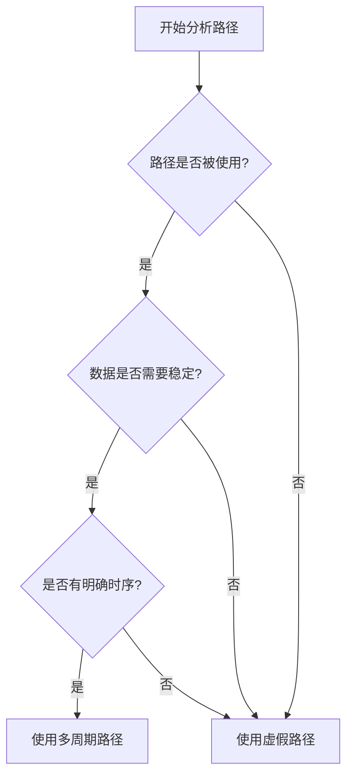

## 🎯 一句话理解作用

**多周期路径** = **给数据更多时间到达目的地**（放松时序要求）
**虚假路径** = **告诉工具这条路径不用检查**（忽略不可能的路径）

---

## 📊 多周期路径（Multicycle Path）的作用

### 🎯 核心作用：放松时序要求

```tcl
# 默认：数据必须在一个时钟周期内稳定
# 多周期：数据可以在多个时钟周期内稳定
set_multicycle_path 2 -setup  # 给数据2个周期时间
```

### 💡 实际应用场景

#### 场景 1：慢速数据路径
```verilog
// 你的ClosedLoop_Inv项目中的ADC数据
always @(posedge CLK_100M) begin
    // ADC数据每16M更新一次，但控制逻辑在100M
    // 不需要每个100M周期都检查setup/hold
    adc_data_reg <= adc_data_from_16m;
end
```

#### 场景 2：复杂计算逻辑
```verilog
// 复杂数学运算需要多个周期
always @(posedge CLK_100M) begin
    if (calc_start) begin
        // 这个计算需要3个周期完成
        result <= complex_math_operation(data);
    end
end
```

#### 场景 3：使能信号控制的逻辑
```verilog
// 数据只在使能有效时更新
always @(posedge CLK_100M) begin
    if (data_enable) begin  // 每4个周期才有效一次
        data_out <= data_in;
    end
end
```

### 📈 多周期路径的好处

| 作用 | 说明 | 影响 |
|------|------|------|
| **放松 setup 要求** | 给数据更多时间稳定 | ✅ 减少 setup 违规 |
| **改善时序收敛** | 工具更容易满足时序 | ✅ 提高最大频率 |
| **减少过度优化** | 避免不必要的优化 | ✅ 节省面积和功耗 |
| **反映真实设计** | 匹配实际数据流动 | ✅ 更真实的时序分析 |

---

## 🚫 虚假路径（False Path）的作用

### 🎯 核心作用：忽略不可能的路径

```tcl
# 告诉工具：这条路径永远不会被使用，不用检查
set_false_path -from [get_clocks CLK_A] -to [get_clocks CLK_B]
```

### 💡 实际应用场景

#### 场景 1：异步复位
```verilog
// 复位信号是异步的，不应该参与时序检查
always @(posedge CLK_100M or negedge RST_N) begin
    if (!RST_N) 
        state <= IDLE;  // 异步复位路径
    else
        state <= next_state;  // 正常时序路径
end
```

#### 场景 2：跨时钟域信号
```verilog
// 你的项目中的ADC数据跨域传输
// 16M时钟域 -> 100M时钟域
// 这种路径天生无法满足setup/hold，应该设为虚假路径
```

#### 场景 3：测试/配置路径
```verilog
// 仅在测试模式使用的路径
always @(posedge CLK_100M) begin
    if (TEST_MODE)  // 正常工作时永远不会为1
        test_reg <= test_data;  // 虚假路径
    else
        normal_reg <= normal_data;  // 真实路径
end
```

#### 场景 4：多路选择器的未用路径
```verilog
// 多路选择器的一些输入永远不会被选择
always @(*) begin
    case (sel)
        2'b00: out = in_a;  // 真实路径
        2'b01: out = in_b;  // 真实路径
        2'b10: out = in_c;  // 真实路径
        2'b11: out = 1'b0;  // 虚假路径 - 永远不会选择in_d
    endcase
end
```

### 📈 虚假路径的好处

| 作用 | 说明 | 影响 |
|------|------|------|
| **减少虚假违规** | 消除不可能的时序违规 | ✅ 更干净的时序报告 |
| **专注真实路径** | 工具只优化真实路径 | ✅ 提高优化效率 |
| **避免过度约束** | 防止不合理的时序要求 | ✅ 更宽松的设计空间 |
| **加速时序分析** | 减少需要分析的路径 | ✅ 更快的编译时间 |

---

## 🔍 在你的 ClosedLoop_Inv 项目中的具体应用

### 多周期路径实例：
```tcl
# ADC数据路径 - 数据每16M更新一次，控制逻辑在100M
set_multicycle_path 6 -from [get_clocks {PLL1|altpll_component|auto_generated|pll1|clk[0]}] \
                    -to [get_clocks {PLL1|altpll_component|auto_generated|pll1|clk[1]}] \
                    -through [get_cells *DataAcquisition*] \
                    -setup -end
# 解释：16M到100M，100/16≈6，所以给6个周期
```

### 虚假路径实例：
```tcl
# 复位信号路径
set_false_path -from [get_ports RST_N] -to [get_clocks *]

# 跨时钟域控制信号（使用双触发器同步的）
set_false_path -from [get_clocks {PLL1|altpll_component|auto_generated|pll1|clk[0]}] \
               -to [get_clocks {PLL1|altpll_component|auto_generated|pll1|clk[1]}] \
               -through [get_cells *Global_reset*]

# 保护电路紧急路径
set_false_path -through [get_cells *HardwareProtection*]
```

---

## 🎯 关键区别总结

| 对比维度 | 多周期路径 | 虚假路径 |
|----------|------------|----------|
| **目的** | 放松时序要求 | 完全忽略路径 |
| **适用场景** | 数据确实需要多个周期 | 路径永远不会被使用 |
| **时序检查** | 仍然检查时序，但用更宽松的约束 | 完全不检查时序 |
| **对频率的影响** | 通常**提高**最大频率 | 通常不影响最大频率 |
| **使用频率** | 经常使用 | 谨慎使用 |

## 💡 实用建议

### 什么时候用**多周期路径**？
- ✅ 数据更新频率低于时钟频率
- ✅ 复杂逻辑确实需要多个周期
- ✅ 使能信号控制的间歇性数据流
- ✅ 想放松时序要求但路径仍然重要

### 什么时候用**虚假路径**？
- ✅ 异步复位信号
- ✅ 跨时钟域路径（配合同步器使用）
- ✅ 测试/配置模式专用的路径
- ✅ 多路选择器中永远不会选择的输入
- ✅ 硬件保护电路的紧急路径

记住：**多周期路径是"放松"，虚假路径是"忽略"** - 这是两个完全不同的概念！
        
## 🎯 核心概念：多周期路径 vs 虚假路径

### 📌 多周期路径（Multicycle Path）
- **目的**：允许数据在多个时钟周期内传输
- **适用**：数据确实需要多个周期，但最终会稳定
- **效果**：放松时序要求，提高时序收敛性

### 📌 虚假路径（False Path）
- **目的**：完全忽略某些路径的时序分析
- **适用**：路径永远不会被使用，或确实异步
- **效果**：减少虚假时序违规，专注真实路径

---

## 🔍 第一步：分析你的 ClosedLoop_Inv 设计

## 🔍 第二步：识别路径类型

### 📊 时钟域分析
- **ADC 采样时钟**: `CLK_16M` (16 MHz) - 来自 PLL clk[0]
- **主控制时钟**: `CLK_100M` (100 MHz) - 来自 PLL clk[1] 
- **接口时钟**: `CLK_50M` (50 MHz) - 外部输入
- **DSP 时钟**: `DSP_CLK` (4.2 MHz) - 外部输入

---

## 🎯 第三步：制定约束策略

### 📝 策略 1：多周期路径（可以优化）

```tcl
#**************************************************************
# 多周期路径约束 - 数据稳定传输
#**************************************************************

# 1. ADC采样数据到控制算法 (16M -> 100M)
# 数据在多个采样周期内稳定，可以用多周期路径
set_multicycle_path 2 -from [get_clocks {PLL1|altpll_component|auto_generated|pll1|clk[0]}] \
                      -to [get_clocks {PLL1|altpll_component|auto_generated|pll1|clk[1]}] \
                      -through [get_cells *DataAcquisition*] \
                      -setup -end

set_multicycle_path 1 -from [get_clocks {PLL1|altpll_component|auto_generated|pll1|clk[0]}] \
                      -to [get_clocks {PLL1|altpll_component|auto_generated|pll1|clk[1]}] \
                      -through [get_cells *DataAcquisition*] \
                      -hold -end

# 2. 数据处理模块内部的计算路径
# 复杂数学运算需要多个时钟周期
set_multicycle_path 3 -from [get_clocks {PLL1|altpll_component|auto_generated|pll1|clk[1]}] \
                      -to [get_clocks {PLL1|altpll_component|auto_generated|pll1|clk[1]}] \
                      -through [get_cells *INV_Data_Process*] \
                      -setup

# 3. DSP数据读取路径 (100M -> DSP_CLK)
# DSP接口通常有缓冲，可以放宽时序
set_multicycle_path 2 -from [get_clocks {PLL1|altpll_component|auto_generated|pll1|clk[1]}] \
                      -to [get_clocks {DSP_CLK}] \
                      -through [get_cells *FPGA_DSP_Data*] \
                      -setup
```

### 🚫 策略 2：虚假路径（完全忽略）

```tcl
#**************************************************************
# 虚假路径约束 - 永远不会使用的路径
#**************************************************************

# 1. 复位信号路径（异步复位）
set_false_path -from [get_ports RST_N] -to [get_clocks *]
set_false_path -from [get_clocks *] -to [get_ports RST_N]

# 2. 测试/调试路径（仅在测试模式使用）
set_false_path -through [get_cells *Pre_PFC*] -through [get_cells *PWM_Delay*]

# 3. 保护电路的紧急路径（硬件保护，不依赖时钟）
set_false_path -through [get_cells *HardwareProtection*] -through [get_cells *SoftwareProtection*]

# 4. 未使用的DSP地址路径
set_false_path -through [get_cells *FPGA_DSP_Data*] -filter {DSP_Address == 16'hFFFF}

# 5. 跨时钟域的控制信号（使用双触发器同步的）
set_false_path -from [get_clocks {PLL1|altpll_component|auto_generated|pll1|clk[0]}] \
               -to [get_clocks {PLL1|altpll_component|auto_generated|pll1|clk[1]}] \
               -through [get_cells *Global_reset*]

# 6. 风扇控制等低速信号
set_false_path -through [get_cells *Fan_Delay*]
```

---

## 🛠️ 第四步：创建完整的约束文件
## 🔧 第五步：验证和调试

### 验证命令：
```tcl
# 检查时序例外
report_exceptions -summary

# 检查多周期路径
report_timing -from_clock [get_clocks {PLL1|altpll_component|auto_generated|pll1|clk[0]}] \
              -to_clock [get_clocks {PLL1|altpll_component|auto_generated|pll1|clk[1]}] \
              -through [get_cells *DA1*]

# 检查虚假路径
report_timing -false_path -from [get_ports RST_N]

# 查看时序收敛改善
report_timing -nworst 10 -setup
```

## 💡 实用技巧和最佳实践

### 1. 渐进式约束策略
```tcl
# 第一步：先识别关键路径
report_timing -nworst 20 -from_clock clk16m -to_clock clk100m

# 第二步：为数据路径设置多周期
set_multicycle_path 2 -from_clock clk16m -to_clock clk100m -through data_path

# 第三步：为控制信号设置虚假路径
set_false_path -from_clock clk16m -to_clock clk100m -through control_path
```

### 2. 使用通配符简化约束
```tcl
# 使用通配符匹配相似模块
set_multicycle_path 2 -through [get_cells *DataAcquisition*]
set_false_path -through [get_cells *Protection*]
```

### 3. 建立约束层次结构
```tcl
# 文件：constraints_multicycle.sdc - 多周期路径约束
# 文件：constraints_falsepath.sdc - 虚假路径约束  
# 文件：constraints_clocks.sdc - 时钟约束
```

## 🎯 总结：如何选择？

| 路径类型 | 特征 | 约束选择 | 例子 |
|---------|------|----------|------|
| **多周期路径** | 数据需要多个周期稳定传输 | `set_multicycle_path` | ADC 数据→控制算法 |
| **虚假路径** | 永远不会触发或确实异步 | `set_false_path` | 复位信号、保护电路 |

**关键原则**：
- ✅ **能优化的用多周期** - 提高时序收敛性
- ✅ **不能优化的用虚假路径** - 减少虚假违规
- ✅ **先分析后约束** - 理解路径行为再选择约束类型

这样你就能**精准控制**时序约束，既保证性能又避免过度约束！


用具体的例子和实用的判断标准来帮你区分"能优化"和"不能优化"的路径。

## 🎯 核心判断标准

### ✅ 能优化的路径特征
- **数据会稳定下来** - 最终需要正确的值
- **有明确的时序关系** - 知道何时需要数据
- **路径确实被使用** - 功能上需要这条路径

### ❌ 不能优化的路径特征
- **永远不会触发** - 功能上不需要
- **确实异步** - 没有固定时序关系
- **只用于测试/调试** - 正常工作时不用

---

## 🔍 在你的 ClosedLoop_Inv 项目中具体分析

### 📊 能优化的路径（使用多周期路径）

#### 1. ADC 采样数据路径
```verilog
// 16M时钟域：ADC采样
DataAcquisition DA1(.CLK(CLK_16M), .FPGA_Data_Done(FPGA_Data_Ready), ...);
// 100M时钟域：数据处理  
D_Trig_16bit DT1(.CLK(CLK_100M), .D_Data(MAINS1_VOL_L1_PRI_1), ...);

// ✅ 能优化原因：
// - 数据最终会稳定
// - 控制算法需要正确的采样值
// - 有明确的采样完成信号
```

**约束策略**：
```tcl
# 数据路径可以优化 - 用多周期路径
set_multicycle_path 2 -from [get_clocks {PLL1|altpll_component|auto_generated|pll1|clk[0]}] \
                      -to [get_clocks {PLL1|altpll_component|auto_generated|pll1|clk[1]}] \
                      -through [get_cells *DA1*] \
                      -setup -end
```

#### 2. 控制算法计算路径
```verilog
// 100M时钟域：复杂数学运算
INV_Data_Process IDP1(.CLK(CLK_100M), .Start(AD_CLK), ...);
INV_Control_single ICS1(.CLK(CLK_100M), .Start(DataProcess_Ready), ...);

// ✅ 能优化原因：
// - 复杂计算需要多个周期
// - 有Start信号控制计算时序
// - 结果会稳定下来
```

**约束策略**：
```tcl
# 计算路径可以优化
set_multicycle_path 3 -from [get_clocks {PLL1|altpll_component|auto_generated|pll1|clk[1]}] \
                      -to [get_clocks {PLL1|altpll_component|auto_generated|pll1|clk[1]}] \
                      -through [get_cells *IDP1*] \
                      -setup
```

#### 3. DSP 接口数据路径
```verilog
// 100M时钟域：FPGA准备数据
FPGA_DSP_Data FPD1(.CLK_FPGA_WR(CLK_100M), .FPGA_Data_Ready(FPGA_Data_Ready), ...);
// DSP时钟域：DSP读取数据
FPGA_DSP_Data FPD1(.CLK_DSP_RD(DSP_CLK), ...);

// ✅ 能优化原因：
// - 有Data_Ready信号协调
// - DSP接口通常有FIFO缓冲
// - 数据需要稳定传输
```

---

### 🚫 不能优化的路径（使用虚假路径）

#### 1. 复位信号路径
```verilog
// 异步复位
input RST_N;
Global_reset GS(.CLK(CLK_100M), .RST(RST_N_2), ...);

// ❌ 不能优化原因：
// - 复位是异步的
// - 没有固定时序关系
// - 复位期间时序不重要
```

**约束策略**：
```tcl
# 复位路径不能优化 - 用虚假路径
set_false_path -from [get_ports RST_N] -to [get_clocks *]
set_false_path -from [get_clocks *] -to [get_ports RST_N]
```

#### 2. 硬件保护紧急路径
```verilog
// 硬件保护信号（过流、过压等）
HardwareProtection HP1(.INV_CUR_L1_OCP(INV_CUR_L1_OCP), ...);
// 直接控制PWM输出
assign INV_S10_L1 = hd_protection ? 1'b0 : INV_S10_L1_w;

// ❌ 不能优化原因：
// - 保护信号是异步的
// - 响应时间要求不确定
// - 安全功能不依赖精确时序
```

**约束策略**：
```tcl
# 保护路径不能优化
set_false_path -through [get_cells *HP1*]
set_false_path -through [get_cells *SP1*]
```

#### 3. 测试和配置路径
```verilog
// 预充电等待、PWM延迟等
Pre_PFC PP1(.CLK_50M(CLK_50M), .SLOWUP_Start(SLOWUP_Start), ...);
PWM_Delay PD10(.CLK_50M(CLK_50M), .PWM_Start(PWM_Start), ...);

// ❌ 不能优化原因：
// - 只在启动时使用
// - 正常工作时这些路径不活跃
// - 时序要求宽松
```

---

## 🛠️ 实用判断流程图



---

## 📋 针对你项目的具体建议

### 🎯 能优化的路径（多周期路径）

```tcl
# ✅ 这些路径可以优化：

# 1. ADC数据采样路径
set_multicycle_path 2 -from [get_clocks {PLL1|altpll_component|auto_generated|pll1|clk[0]}] \
                      -to [get_clocks {PLL1|altpll_component|auto_generated|pll1|clk[1]}] \
                      -through [get_cells *DA1*]

# 2. 数据处理计算路径  
set_multicycle_path 3 -through [get_cells *IDP1*] -setup

# 3. DSP数据传输路径
set_multicycle_path 2 -through [get_cells *FPD1*] -setup
```

### 🚫 不能优化的路径（虚假路径）

```tcl
# ❌ 这些路径不能优化：

# 1. 复位和初始化
set_false_path -through [get_cells *GS*]
set_false_path -from [get_ports RST_N]

# 2. 保护电路
set_false_path -through [get_cells *HP1*]
set_false_path -through [get_cells *SP1*]

# 3. 低速控制（风扇、继电器）
set_false_path -through [get_cells *FDe1*]
set_false_path -through [get_cells *RD1*]

# 4. 启动时序（预充电、PWM延迟）
set_false_path -through [get_cells *PP1*]
set_false_path -through [get_cells *PD10*]
```

---

## 🔍 验证方法

### 检查多周期路径效果：
```tcl
# 查看多周期路径是否改善了时序
report_timing -through [get_cells *DA1*] -setup

# 检查关键路径是否减轻
report_timing -nworst 10 -setup
```

### 检查虚假路径是否正确：
```tcl
# 确认虚假路径不再出现时序违规
report_timing -false_path -through [get_cells *HP1*]

# 检查时序例外统计
report_exceptions -summary
```

## 💡 一句话总结

**能优化** = 数据最终会稳定且功能需要的路径  
**不能优化** = 异步、永不使用或时序不重要的路径

按照这个标准，你就能**精准选择**多周期路径还是虚假路径