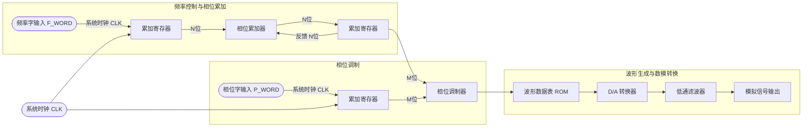

          
# DDS信号发生器学习笔记

## 📚 参考资料
- [dsplover/DDS： FPGA Cyclone II EP2C5T144C8 与 MSP430f6638 实现 DDS（信号发生器）](https://github.com/dsplover/DDS)-开源FPGA信号发生器代码
- [DDS的原理、技术文章及常用器件](https://www.eetree.cn/doc/detail/47)
- [野火FPGA开发实战指南 - 简易DDS信号发生器的设计与验证](https://doc.embedfire.com/fpga/altera/ep4ce10_pro/zh/latest/code/dds.html)
- https://www.eetree.cn/wiki/dds_verilog
- [基于FPGA的函数信号发生器设计_基于fpga的信号发生器设计-CSDN博客](https://blog.csdn.net/xxqlover/article/details/139199969)


## 设计工具
- https://www.analog.com/cn/resources/interactive-design-tools/rf-impedance-matching-calculator.html
- https://tools.analog.com/cn/simdds/?harmonicDB=-50&mult=1&part=AD9914&rso=111111&sclock=3.5G&tof=1.28G&useFilters=0
- https://tools.analog.com/cn/dacerrorbudget/
- Guagle_wave_波形Mif文件生成工具 -用于生成预设的波形数据

## 📖 目录
1. [DDS基本概念](DDS%E4%BF%A1%E5%8F%B7%E5%8F%91%E7%94%9F%E5%99%A8.md##dds%E5%9F%BA%E6%9C%AC%E6%A6%82%E5%BF%B5)
2. [DDS系统架构](DDS%E4%BF%A1%E5%8F%B7%E5%8F%91%E7%94%9F%E5%99%A8.md##dds%E7%B3%BB%E7%BB%9F%E6%9E%B6%E6%9E%84)
3. [核心模块详解](DDS%E4%BF%A1%E5%8F%B7%E5%8F%91%E7%94%9F%E5%99%A8.md##%E6%A0%B8%E5%BF%83%E6%A8%A1%E5%9D%97%E8%AF%A6%E8%A7%A3)
4. [数学原理与计算](DDS%E4%BF%A1%E5%8F%B7%E5%8F%91%E7%94%9F%E5%99%A8.md##%E6%95%B0%E5%AD%A6%E5%8E%9F%E7%90%86%E4%B8%8E%E8%AE%A1%E7%AE%97)
5. [实际设计考虑](DDS%E4%BF%A1%E5%8F%B7%E5%8F%91%E7%94%9F%E5%99%A8.md##%E5%AE%9E%E9%99%85%E8%AE%BE%E8%AE%A1%E8%80%83%E8%99%91)
6. [DAC技术详解](DDS%E4%BF%A1%E5%8F%B7%E5%8F%91%E7%94%9F%E5%99%A8.md##dac%E6%8A%80%E6%9C%AF%E8%AF%A6%E8%A7%A3)
7. [有无DAC的信号发生器对比](DDS%E4%BF%A1%E5%8F%B7%E5%8F%91%E7%94%9F%E5%99%A8.md##%E6%9C%89%E6%97%A0dac%E7%9A%84%E4%BF%A1%E5%8F%B7%E5%8F%91%E7%94%9F%E5%99%A8%E5%AF%B9%E6%AF%94)

---

## 1. DDS基本概念

**DDS（Direct Digital Synthesizer）** - 直接数字式频率合成器，是一项关键的数字化技术。

### 🎯 主要优势
- ✅ **低成本**：相比传统频率合成器
- ✅ **低功耗**：数字化实现
- ✅ **高分辨率**：精确的频率控制
- ✅ **快速转换**：频率切换时间短

### 🔧 应用领域
- 电信通信系统
- 电子测试仪器
- 音频信号生成
- 雷达系统
- 软件无线电

### 📊 支持波形类型
- 正弦波（Sine Wave）
- 锯齿波（Sawtooth Wave）
- 三角波（Triangle Wave）
- 方波（Square Wave）

---

## 2. DDS系统架构



### 🏗️ 四大核心结构
1. **相位累加器** - DDS的核心，生成相位码
2. **相位调制器** - 实现相位偏移和调制
3. **波形存储器** - 存储预计算的波形数据
4. **数模转换器** - 将数字信号转换为模拟输出

---

## 3. 核心模块详解

### 🔄 相位累加器（Phase Accumulator）
- **功能**：DDS系统的心脏，完成相位累加生成相位码
- **输入**：频率控制字 K（频率字 F_WORD）
- **位宽**：N位（通常32位）
- **工作原理**：每个时钟周期累加频率字，产生线性增长的相位值

**关键公式**：
```
K = 2^N × f_OUT / f_CLK
```

### 📡 相位调制器（Phase Modulator）
- **功能**：在相位码基础上添加相位偏移
- **输入**：相位控制字 P（相位字 P_WORD）
- **应用**：相移键控（PSK）、相位调制等通信应用
- **可选性**：不需要时可设为常数或移除

### 💾 波形数据表ROM（Waveform ROM）
- **存储内容**：一个完整周期的波形采样数据
- **典型配置**：
  - 地址位宽：12位（4096个存储单元）
  - 数据位宽：8位（256个幅度等级）
  - 采样点数：2^12 = 4096点/周期

**数据生成过程**：
1. 将一个周期正弦波等间隔采样4096次
2. 每个采样值用8位表示（0-255）
3. 按顺序存入ROM的4096个地址

### 🔌 数模转换器（DAC）
- **功能**：将数字幅度值转换为模拟电压/电流
- **输入**：来自ROM的数字幅度数据
- **输出**：连续的模拟信号

---

## 4. 数学原理与计算

### 📐 基本频率关系

**输出频率公式**：
```
f_OUT = K × f_CLK / 2^N
```

**频率分辨率**：
```
Δf = f_CLK / 2^N  (当K=1时)
```

**最大输出频率**：
```
f_MAX < f_CLK / 2  (奈奎斯特定理)
```

### 🧮 设计实例计算

**假设条件**：
- 系统时钟：f_CLK = 100MHz
- 相位累加器位宽：N = 32位
- ROM地址位宽：M = 12位
- ROM数据位宽：8位

**计算结果**：
- 频率分辨率：Δf = 100MHz / 2^32 ≈ 0.023Hz
- 最大输出频率：f_MAX < 50MHz
- ROM存储容量：4096 × 8bit = 32KB

### 📊 位宽分配策略

当相位累加器为32位，ROM地址为12位时：
- **高12位**：用于ROM寻址（相位调制器输入）
- **低20位**：提供频率精度，不直接参与ROM寻址

**频率控制字K=1的工作过程**：
1. 低20位累加器每次+1
2. 低20位溢出时向高12位进位
3. ROM中每个地址被读取2^20次
4. 输出频率 = f_CLK / 2^32

---

## 5. 实际设计考虑

### ⚖️ 性能权衡

| 参数 | 增加的影响 | 权衡考虑 |
|------|------------|----------|
| 相位累加器位宽(N) | 频率分辨率↑，资源消耗↑ | 根据应用精度需求选择 |
| ROM地址位宽(M) | 波形精度↑，存储容量↑ | 平衡精度与成本 |
| ROM数据位宽 | 幅度分辨率↑，存储容量↑ | 考虑DAC位宽匹配 |
| 系统时钟频率 | 最大输出频率↑，功耗↑ | 受器件性能限制 |

### 🎛️ 优化策略

1. **相位截断**：使用相位累加器高位寻址，降低ROM容量需求
2. **幅度压缩**：采用压缩算法减少ROM存储
3. **插值技术**：在ROM输出后进行插值，提高波形平滑度
4. **流水线设计**：提高系统工作频率

### 🔧 工程实现要点

- **时钟域同步**：确保所有寄存器在同一时钟域
- **数据寄存**：频率字和相位字变化时避免干扰
- **ROM初始化**：预计算波形数据并正确加载
- **DAC接口**：匹配DAC的数据格式和时序要求

---

## 6. DAC技术详解

### 🔄 DAC基本原理

**DAC（Digital to Analog Converter）** - 数模转换器，将数字信号转换为模拟信号的关键器件。

### 🏗️ DAC内部结构

**基本组成**：
- 电阻阵列网络
- n个电流/电压开关
- 参考电压源
- 输出放大器（可选）

### 📊 DAC分类

#### 按输出类型分类

| 类型 | 特点 | 优势 | 应用场景 |
|------|------|------|----------|
| **电压输出型** | 直接输出电压信号 | 接口简单，驱动能力强 | 通用信号发生器 |
| **电流输出型** | 输出电流信号 | 速度快，精度高 | 高速应用，需外接I-V转换 |

#### 按电路结构分类

**电压型DAC**：
- 权电阻网络
- T形电阻网络  
- 树形开关网络

**电流型DAC**：
- 权电流型电阻网络
- 倒T形电阻网络

### 📏 DAC关键技术指标

#### 1. 分辨率（Resolution）
- **定义**：输出模拟电压的最小增量
- **计算**：LSB = V_REF / 2^n（n为DAC位数）
- **示例**：12位DAC，5V参考 → LSB = 5V/4096 ≈ 1.22mV

#### 2. 线性度（Linearity）
- **理想情况**：输入数字量等量增加，输出模拟量等量增加
- **实际偏差**：积分非线性(INL)、微分非线性(DNL)

#### 3. 转换精度（Accuracy）
- **影响因素**：
  - DAC芯片本身精度
  - 外围电路配置
  - 参考电压稳定性
  - 温度漂移

#### 4. 转换速度（Speed）
- **建立时间**：数字输入变化到模拟输出稳定的时间
- **转换速率**：单位时间内可完成的转换次数
- **一般规律**：电流输出型 > 电压输出型

### ⚡ 高速DAC设计考虑

1. **无输出放大器设计**：减少延迟，适用于高阻抗负载
2. **差分输出结构**：提高抗干扰能力
3. **电流舵结构**：实现高速切换
4. **片上校准**：补偿工艺偏差

---

## 7. 有无DAC的信号发生器对比

### 🔍 核心区别分析

信号发生器是否集成DAC决定了其输出能力和应用范围的根本差异。

### 📊 详细对比表

| 对比维度 | 有DAC的信号发生器 | 无DAC的信号发生器 |
|----------|-------------------|-------------------|
| **输出信号类型** | 连续模拟信号（正弦波、三角波、锯齿波等） | 离散数字信号（方波、脉冲序列等） |
| **信号精度** | 高精度（取决于DAC位数） | 低精度（仅数字电平精度） |
| **频率范围** | DC到奈奎斯特频率 | 受数字逻辑速度限制 |
| **幅度控制** | 连续可调（DAC分辨率内） | 固定电平（VCC/GND） |
| **波形质量** | 平滑连续 | 阶跃变化 |
| **实现复杂度** | 较高（需要DAC、滤波器等） | 较低（纯数字逻辑） |
| **成本** | 较高 | 较低 |
| **功耗** | 较高（模拟电路） | 较低（数字电路） |

### 🎯 应用场景对比

#### 有DAC的信号发生器适用于：

**🔬 模拟电路测试**
- 放大器频响测试
- 滤波器特性验证
- ADC性能测试
- 传感器校准

**🎵 音频应用**
- 音乐信号合成
- 语音处理
- 音频设备测试
- 声学测量

**📡 通信系统**
- 调制信号生成
- 载波合成
- 基带信号处理
- 软件无线电

**🔬 科学测量**
- 物理量仿真
- 标准信号源
- 精密测量

#### 无DAC的信号发生器适用于：

**💻 数字电路测试**
- 时钟信号生成
- 复位信号控制
- 使能信号控制
- 逻辑电平测试

**📱 通信协议仿真**
- UART串口信号
- SPI总线信号
- I2C总线信号
- CAN总线信号

**🎮 控制应用**
- PWM信号生成
- 步进电机控制
- 数字开关控制
- 定时触发信号

**🔧 系统调试**
- 中断信号模拟
- 状态机测试
- 时序验证

### 💡 选择建议

**选择有DAC的信号发生器，当你需要：**
- ✅ 连续可变的模拟信号
- ✅ 高精度的幅度控制
- ✅ 复杂波形生成
- ✅ 模拟电路接口

**选择无DAC的信号发生器，当你需要：**
- ✅ 简单的数字控制信号
- ✅ 低成本解决方案
- ✅ 低功耗设计
- ✅ 纯数字系统接口

### 🔄 混合解决方案

在实际项目中，可以采用混合方案：
- **主要信号**：使用有DAC的DDS生成精确模拟信号
- **控制信号**：使用数字逻辑生成时钟、使能等控制信号
- **成本优化**：根据信号重要性分配不同精度的DAC

---

## 📝 总结

DDS技术作为现代信号发生器的核心技术，通过数字化方法实现了高精度、高稳定性的信号合成。理解其工作原理、设计要点和应用场景，对于FPGA工程师来说至关重要。

### 🎯 学习要点回顾

1. **核心概念**：掌握DDS的基本原理和四大组成部分
2. **数学基础**：理解频率控制字与输出频率的关系
3. **设计权衡**：平衡精度、资源消耗和性能需求
4. **实现细节**：注意时钟同步、数据寄存等工程问题
5. **DAC选择**：根据应用需求选择合适的DAC类型和参数

### 🚀 进阶学习方向

- **高级DDS技术**：相位噪声优化、杂散抑制
- **多通道DDS**：相位相干、幅度匹配
- **软件DDS**：基于处理器的实现方案
- **射频DDS**：高频应用的特殊考虑

