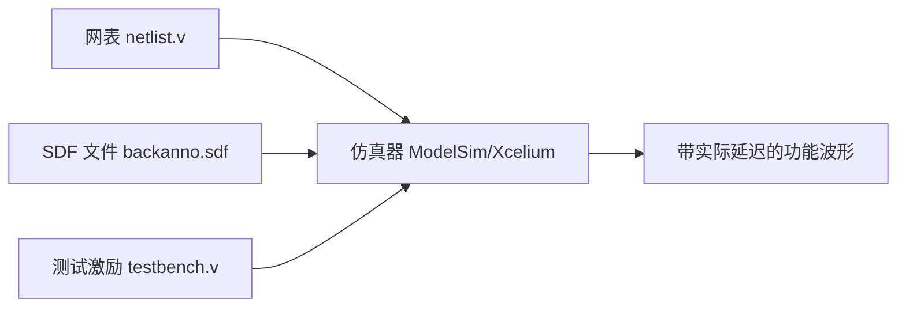

> 摘要：反标是 FPGA 物理实现与前端设计之间的关键反馈通道，通过将布局布线阶段生成的实际时序、位置和寄生参数数据反向注入上游工具，实现精准验证、约束优化与迭代加速。
> 标签： #FPGA/设计流程 #EDA工具 #时序分析  #反标 (Back_Annotation)  

## 🧩 核心定义
**反标（Back Annotation）** 是指将 FPGA 布局布线（Place & Route）等物理实现阶段生成的**实际硬件参数**，反向传递至综合、时序分析或仿真工具中，用于修正模型偏差、提升验证精度与优化后续迭代的过程。

- **输入来源**：布局布线工具（如 Xilinx Vivado、Intel Quartus）
- **目标工具**：综合器、STA 工具、功能/时序仿真器、信号完整性分析工具
- **核心目的**：
  - 替代理想化预估模型，引入真实延迟与物理特性
  - 验证设计在真实芯片中的行为是否符合预期
  - 反馈优化信息以指导新一轮实现（Design Closure）

> 📌 关键思想：**从“预测→实现→反馈→修正”的闭环流程，是现代 FPGA 设计收敛的核心路径之一**。

---

## 🔗 四大应用场景（模块化结构重组）

### 1️⃣ 时序延迟反标 → 验证时序约束的实际满足性

#### 背景痛点
综合阶段采用统计性延迟模型（基于工艺库+经验估算），无法反映真实布线影响。若仅依赖此模型，可能导致严重时序违例遗漏。

#### 反标实现方式
| 输出数据 | 文件格式 | 反标对象 | 作用 |
|--------|--------|--------|------|
| 实际单元/路径延迟 | `.sdf` (Standard Delay Format) | 静态时序分析（STA）工具 综合工具（可选） | 替代理想延迟值，进行精确时序检查 |

#### 应用价值
- ✅ **重新进行静态时序分析**（Post-Route STA）：
  - 检测建立时间（setup）、保持时间（hold）违例
  - 定位高负载网络、长路径、关键路径瓶颈
- ✅ **驱动综合优化**（回流至综合阶段）：
  - 引导综合工具优先优化关键路径映射
  - 启发式布局建议（e.g., packing related logic closer）
- ✅ **跨时钟域分析修正**：
  - 使用真实时钟树偏斜（skew）和插入延迟（insertion delay）验证 CDC 路径安全

> 💡 典型场景示例：某控制通路前仿通过，但反标 SDF 后发现因布线延迟导致状态跳变滞后一个周期 → 必须增加流水级或调整时钟域划分。

---

### 2️⃣ 物理布局信息反标 → 优化逻辑与布线匹配性

#### 背景需求
FPGA 资源分布不均，布局直接影响布线长度与时序性能；尤其在增量设计中，需保持部分模块稳定。

#### 反标实现方式
| 数据内容 | 文件类型 | 反标对象 | 作用 |
|--------|--------|--------|------|
| CLB/LUT/DSP 实际坐标位置 | Vivado: `.xdl` Quartus: `.qxp`, `.fit.summary` | 设计约束文件（XDC/SDC） | 生成 `LOC="SLICE_XY"` 类型的位置约束 |
| 布线资源占用信息 | 布线报告 / 原理图视图 | 综合脚本 / 手工约束 | 分析拥塞区域并施加分组约束 |

#### 应用价值
- ✅ **支持增量实现（Incremental Compile）**：
  - 锁定已验证模块的物理位置，防止全量重布局破坏原有时序
  - 缩短 P&R 时间，提高回归效率
- ✅ **引导逻辑分区（Floorplanning）**：
  - 若观察到某信号跨越多列 CLB → 在综合阶段使用 `HGROUP` 或 `Pblock` 约束相关逻辑集中布局
- ✅ **识别拥塞瓶颈**：
  - 结合工具可视化查看布线热点，提前插入缓冲区或调整拓扑结构

> 🔄 推荐工作流：
> `首次完整实现 → 提取布局 → 反标为 LOC 约束 → 下次修改仅开放变更模块布局`

---

### 3️⃣ 寄生参数反标 → 提升信号完整性仿真精度

#### 背景挑战
高速信号受 RC/L 效应显著影响，尤其是板内走线较长或内部宽总线切换时易引发：
- 边沿退化（slow rise/fall）
- 振铃（ringing）
- 地弹（ground bounce）

#### 反标实现方式
| 参数提取内容 | 数据格式 | 反标工具 | 行为模拟意义 |
|-------------|---------|----------|--------------|
| 单元间互连寄生电阻电容 | SPICE Netlist (. Spc) | SI 仿真器（如 HyperLynx, ADS） | 构建真实 RC 树模型 |
| IO 缓冲电气特性 | IBIS 模型 (. Ibs) | PCB/SI 仿真环境 | 评估端接匹配效果、反射 |

#### 应用价值
- ✅ 更真实地模拟差分对传输质量（如 LVDS、MGT）
- ✅ 验证片上电源完整性（SSN 分析）
- ✅ 协同 PCB 设计完成联合仿真（Chip-Package-Board Co-Simulation）

> ⚠️ 注意事项：此类流程通常需要额外 license 支持（如 Vivado Interoperability Tools + External SI Solver）

---

### 4️⃣ 后仿真（时序仿真）支撑 → 验证真实时序下的功能行为

#### 对比：前仿真 vs. 后仿真
| 项目 | 功能仿真（前仿真） | 时序仿真（后仿真） |
|------|--------------------|---------------------|
| 是否含延迟 | ❌ 理想延迟（zero delay） | ✅ 包含实际门延迟与布线延迟（来自 SDF） |
| 模拟真实性 | 低（仅验证逻辑正确性） | 高（模拟真实硬件行为） |
| 发现问题类型 | 逻辑错误 | 保持时间违例、异步复位失效、亚稳态传播等 |

#### 实现流程

#### 必要反标动作
- 将 `.sdf` 文件加载进仿真器，并绑定到顶层实例
- 设置仿真模式为 “Timing Check Mode”
- 开启 `$dumpvars` 和 `$sdf_annotate` 系统任务

#### 典型发现的问题
- 数据在时钟边沿附近采样不稳定 → 违反 hold time
- 复位释放不同步导致 FSM 进入非法状态
- 总线竞争引起的 glitch 被捕获

> ✅ 最佳实践：对关键路径（尤其是跨时钟域、复位释放、配置寄存器写入）必须执行后仿真确认。

---

## 📊 总结：反标的三大核心价值

| 价值维度 | 描述 | 支撑技术手段 |
|--------|------|-------------|
| 🔍 **真实性保障** | 突破理想模型局限，暴露真实硬件中潜在风险 | SDF 反标、SI 建模 |
| ⚙️ **流程闭环优化** | 形成“测量→反馈→改进”的正向迭代机制 | LOC 反标、关键路径识别 |
| 🕒 **开发效率提升** | 减少盲目尝试，支持增量设计与精准修复 | 增量编译、约束固化 |

🟩 正向闭环 = **综合 → 实现 → 反标分析 → 约束/架构调整 → 再综合**